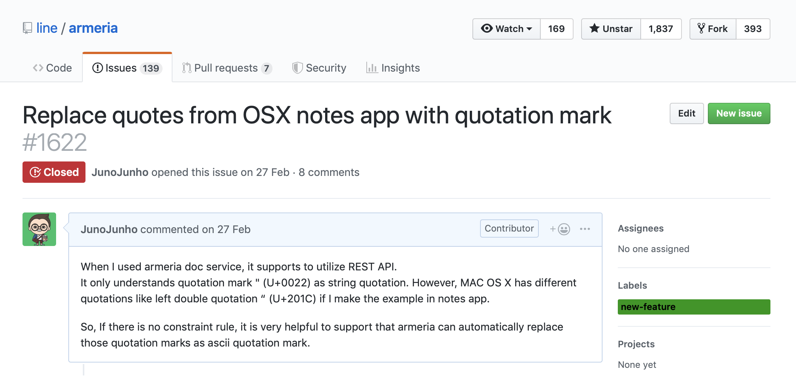
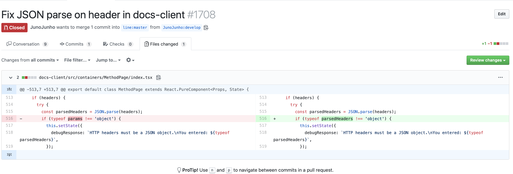
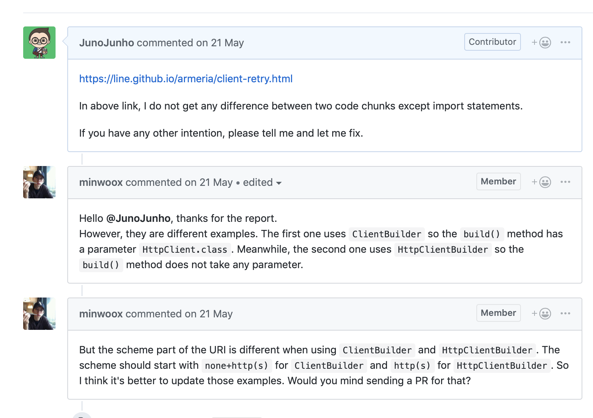
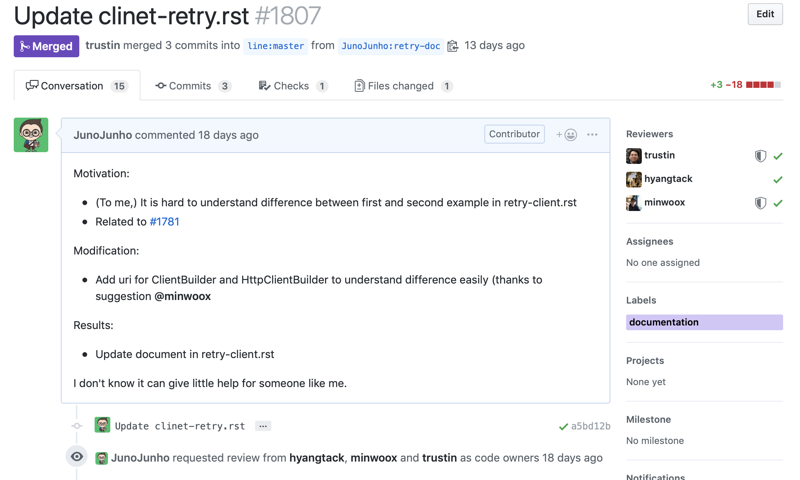

## First Trial, 우연히 bugFix, but Fail
-------

처음 [Armeria](https://line.github.io/armeria/)를 사용하면서, 우연히 되지 않는 기능을 발견했습니다. OS X의 노트 앱에서 무언가를 복사해서 붙여넣다 보니, 자꾸 JSON의 포맷이 깨지게 되는 문제가 발생하는 것입니다.

이 문제가 내가 따옴표 (')를 잘못 넣은 것인지, 아니면 Armeria쪽에서 문제가 있는 것인지 궁금해졌습니다.

#### 이슈를 만들고, 우선 이 기능이 의도된 동작인지 물어보기

(당연히 현재는 close 되었지만) 이슈를 생성해서 이게 맞는 건지, 아닌지 물어보게 되었고, 관련해서 repo 관리하시는 분들이 관련해서 여러가지 제안을 해주시게 되었습니다.

그러다가 코드를 확인해보니, 헤더를 붙이는 부분에서 파싱을 끝내고 난 뒤에 파싱이 끝난 object을 사용하지 않고, 이전의 JSON object를 사용하는 문제가 있었습니다.

#### 그래서 PR을 보냈습니다.

이렇게 보내니, 모두들 몰랐다며 감사를 표해주셨죠. 하지만 이 이슈를 만들고 PR을 작성하는데 게으르게 있다 보니 이미 해당 부분이 바뀌는 breaking change가 발생했고, 이 버그가 자연스럽게 해결되는 현상이 발생했습니다.

> 무언가 알게 되었으면, 빨리 작업해라. 그렇지 않으면 누군가가 해버린다.

##### 누군가가 해버린다면, 나의 컨트리뷰션 기회는 사라지게 되고, 나의 성장 기회도 사라지게 된다.

## Second Trial, Success!
-------

두번째 PR을 작성하는 계기는 Armeria 관련 기능을 살펴보던 도중에 궁금한 점이 생겨서, 또 역시 이슈를 만들게 되었습니다. 보통 기능에 대한 설명이 부족하면, 아 이 doc이 부실하네~ 라고 끝나게 되지만, 오픈소스는 다르게 내가 만들어 낼 수 있습니다. 그리고 그 내용을 실제로 기능을 작성한 사람에게 리뷰를 받을 수 있다는 점이 가장 획기적인 내용이라고 할 수 있죠.

네 제 예상이 맞았습니다. 비록 제 핀트는 벗어났지만, 제가 컨트리 뷰션을 할 기회가 나왔습니다.

#### 드디어 첫 PR!

이야기 된 대로 문서를 수정해서 PR을 작성했습니다.

조금 이야기를 나누며 수정사항을 추가적으로 반영해서 결국 merge 되었습니다. 제가 작성한 수정사항을 저 문서를 읽는 누구나 그 내용을 읽게 된 것이죠. 한편으로는 정말 짜릿한 경험이었습니다.

> 오픈소스에서는 무언가 이상하다면 그건 프로젝트가 이상한 것이 아니라 내가 수정사항을 만들 기회가 온 것이다! 그것을 잡느냐 마느냐는 나의 문제이다.