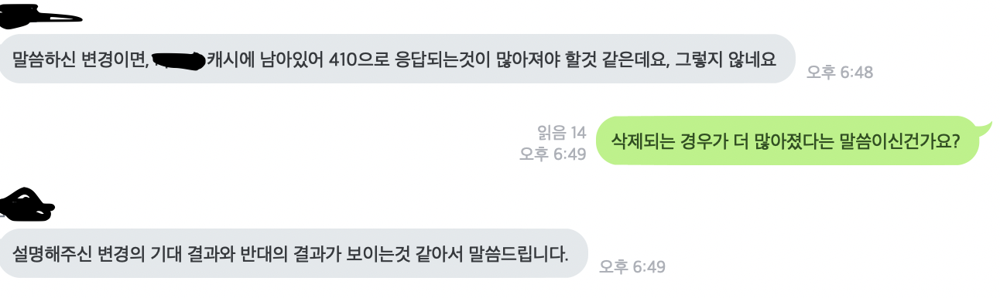

장애 냈습니다.
-------

지난 주 초반, 저는 말 그대로 숙원사업이라 할 수 있는 정도의 변경 사항을 리얼 환경에 배포하였습니다. 어느정도 QA 검증 기간도 거쳤고, 베타 서버에 묵혀둔 기간 동안 제 변경 사항으로 인하여 묵혀둔 내용이 리포트 되지 않았기에 문제가 없다고 판단했죠.

배포가 완료된 4시경, 관련 지표가 약간 상승하긴 했지만, 이는 상당히 당연한 일일거라고 생각하고 저의 숙원사업 배포완료를 축하해주는 동료와 함께 사내 카페에서 맛있는 커피를 즐기고 다시 자리로 돌아왔습니다.

> "Juno님, 배포하신 기능 관련 지표 이상한데요?"

저는 태연했습니다. 이정도의 지표 상승은 당연한 거라는 것 마냥 유창하게 설명했죠.

하지만, 사실은 그렇지 않았습니다.

이 때부터 등에 식은땀이 나기 시작했습니다.

`아 무언가가 잘못되었구나`

사용자가 억단위인 라이브 서비스에 잘못된 변경 사항이 나간것을 알게 되었습니다.

이 때부터 판단력이 흐려지고, 앞으로 장애 보고서를 쓰고, 회고 회의를 하고, 다시 이 변경사항을 롤백한 다음 기나긴 수정 사항을 건드려야 한다는 사실이 현기증처럼 몰려왔습니다.

> "Juno님, 서버에 문제 있어요?"

아, 망했습니다. 리드님께 상황 설명을 하고, 문제 상황을 파악하기 시작했습니다. 그리고 제가 변경한 내용에 로직상에 생각하지 못한 오타가 있다는 것을 발견했지요. 그로 인해서 특정 플랫폼의 유저들 모두 특정 기능에 장애가 나고 있는 상황이었습니다. 그것도 문제를 파악하고 롤백을 결정하기 `8 시간` 동안이요.

리드님의 판단아래 롤백을 결정했습니다. 그 때가 약 오후 10시 30분 즈음이었는데요, 2차 조직장님도 다른일이 있는 것처럼 보였지만, 사실은 장애 상황을 몰래몰래 들으면서 남아계신 것이었습니다. 리드님이 2차 조직장님께 보고하고 롤백을 상의하고 이 내용을 전체 Dev 방에 공유하고 롤백을 진행했습니다.

롤백은 11시 30분즈음에 마무리 되고 `아 오늘은 막차 타고 가겠네..`라는 생각과 함께 아내에게 늦게 간다고 이야기 한게 다행이라고 생각할 즈음..

> "문제는 파악하고 가야죠."

아.. 그렇죠. 원인 분석하고 가야 했습니다.

그렇게 이직한 회사에서 처음으로 새벽 1시에 퇴근하는 경험을 하게 되었습니다.

장애보고서 작성하기
-------

위의 유튜브 영상을 보고, 제가 개인적으로 보고 부럽다고 느낀 실리콘 밸리의 문화 중에서는 문제가 생겼을 때 사람을 blame 하지 않는다는 점입니다.

사람을 탓하지 않고, 이 장애로 인해서 `앞으로 같은 장애를 발생시키지 않는 것`에 그 목적이 있죠.

저희 회사에 장애 보고서 내용에도 그 내용을 충실히 작성하도록 되어 있어서 무언가 `글로벌 기업`이구나 라는 느낌을 받았습니다.

> "Juno님 이쪽 문서 작성해주세요"

라고 링크를 던져주시는 장애에 제가 장애를 낸 날짜, 장애의 감지부터 어떻게 장애 상황을 극복했는지 여부 등 여러가지를 작성하고 재발 방지 대책을 통해서 이 장애를 두번 다시 만나지 않으려면 어떻게 해야 할지도 작성해야만 했죠.

`아 이건 누가봐도 오타 실수 인데, 그리고 그런 버그를 집어 넣은건 나인데.. 이게 시스템상 에러도 아니고;;` 라는 생각과 함께 어찌저찌 보고서를 작성하였습니다. Root Cause는 Bug (errta)라는 말과 함께 말이죠.

장애 회고 회의
------

서버개발 전사로 메일을 돌리고 장애 회고 회의 날짜를 잡고, 동시 통역관 분들과 함께 (글로벌 회사..) 장애 회고 회의 진행을 맡아서 진행했습니다.

다들 제 장애 원인을 듣고 `이런 이유로 장애가 날 수 있구나`라는 신기해 함과 의외로 흥미로운 이슈라며 공감해 주셨습니다.

하지만 높으신 분들의 날카로운 코멘트는 마음이 어려워 지는 순간이 오기도 했습니다. 예를 들어, `개발자 테스트와 QA를 거쳤는데 이게 왜 잡히지 않은것인지 이해가 가지 않는다.` 부터 `장애 상황 캐치가 너무 늦었다.`등 많은 이야기 들이 오고 갔습니다.

언제 지나갔는지도 모를 저의 첫 장애 회고 회의가 그렇게 끝이 났습니다.

그래서 무얼 배웠나?
-----

가장 중요합니다. 그래서 이 장애를 통해서 당신은 `무엇을 배웠나?`가 회사에서 요구하는 가장 핵심이죠.

 - 코드리뷰를 정말 열심히 해야겠다
   - 사실 git에서는 제가 잘못 고쳤다고 이미 표시를 해주었습니다. 그런 diff도 자세히 보지 않은 나는.. 흑..
 - 장애를 낸 것은 부끄러운 사실이 아니다. 장애를 내고 나서 수습하는 과정이 중요하다.
   - 장애는 누구나 낼 수 있습니다. 그것이 의도했던 아니던 간에 말이죠. 하지만 장애 상황을 잘 파악하고, 문제를 캐치해 내는 능력은 담당자가 끝까지 핸들링 해야 하는 영역임을 알 수 있었습니다. (니가 배포한 기능 니가 책임지고 빼라는 거죠)
 - 사람이 아닌 문제를 Blame하자
   - 제가 회사의 개발 문화에 좋아하는 점중 하나인 사람을 blame하지 않고 문제를 blame한다는 점입니다. 이 일이 발생할 수 밖에 없었던 이유에 집중해서 이 이유를 먼저 없애는 노력을 하는 것이죠. 이런 점들이 내부 구성원에게 실수는 할 수 있지만, 앞으로 실수를 줄이려고 노력하는 모습이 더 중요하다고 여기게 되는 큰 전환점이 되게 됩니다.

이번 첫 장애로 많은 것을 배웠습니다.

그리고 회식 하면서 비싼 알코올을 마시고 신체적 장애를 낼 뻔했지만, 그래도 안전하게 귀가하고 저의 첫 장애 회고를 마치게 되었음을 감사하고 있습니다.

여러분 회사의 개발 문화도 이렇게 `사람이 아닌 문제를 Blame하는 문화`를 만들어 보시는 것은 어떨까요?

그럼 이만 총총.
