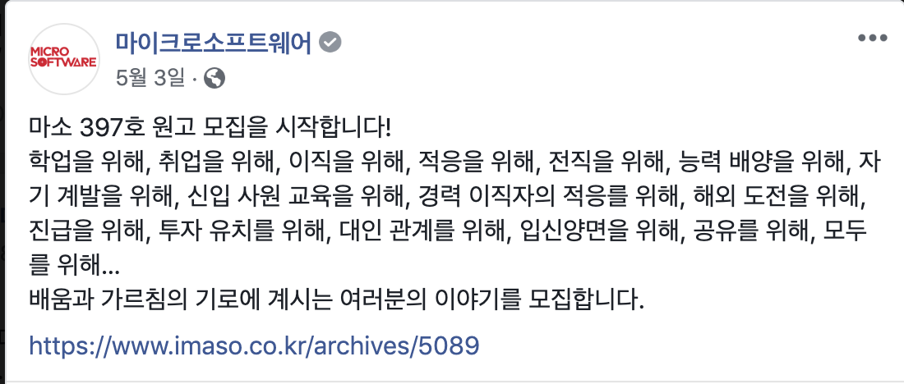
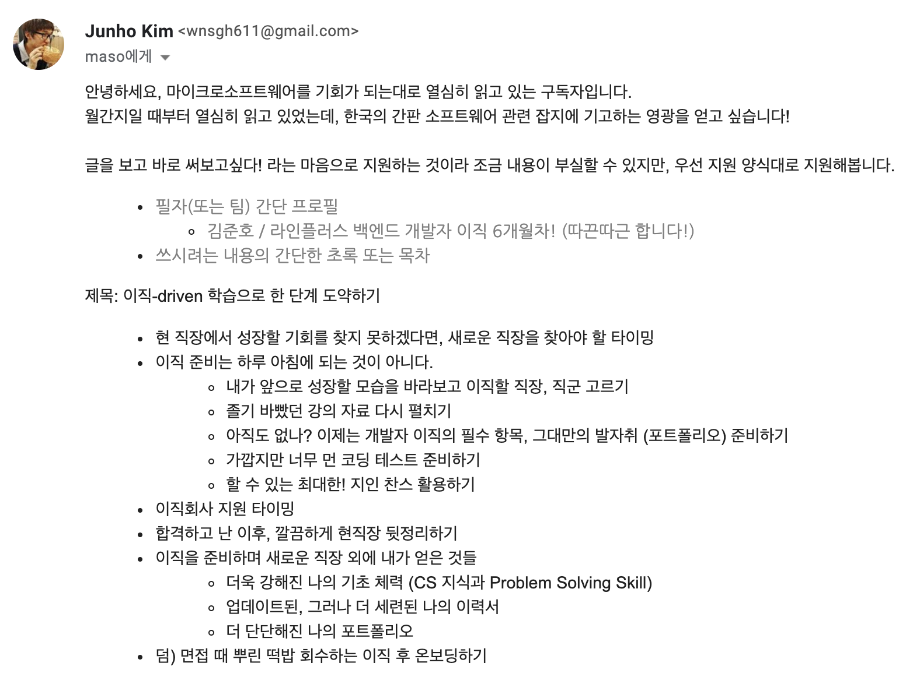

마소 이번 7월호에 필진으로 참여했습니다.
-------

[마이크로 소프트웨어 2019년 7월호](https://www.imaso.co.kr/archives/5256)에 저의 글(`A2. 이직 주도 학습으로 한 단계 도약하기 – 김준호`)이 기고 되었습니다. 마소에 처음으로 기고 한 것은 2012년에 보안 관련 멤버십을 진행하고 관련 내용을 정리해서 기고를 한 다음에 이어서 두번째로군요.

사실 이 글은 약간 즉흥적으로 써야지! 하고 쓴 감이 있는데요.

퍼거슨 전 맨유 감독님이 `SNS는 인생의 낭비다!`라고 말씀을 듣고도 페북을 뒤적뒤적 하다가 아래 포스트를 보았거든요.

흠.. `러닝 커브`라.. 뭔가 기술적이 느낌이 많이 안들어가도 되겠다! 싶어서 냉큼 제 머릿속에서 계산기를 뚜둘겨 보고 있었죠.

- 최근에 내가 배운거? ~~와이프에게 혼나지 않고 게임방 다녀오기~~
- 아 나 비교적 최근에 이직했지!
- 여기서 배운게 뭐가 있었더라?
- 아 나 이력서 정리한거랑 파이콘 썰도 좀 풀어야 겠다 ㅎㅎ

라는 머릿속의 흐름으로 바로 아웃라인을 잡았습니다.

그리고 창작(이라 쓰고 응가라고 합니다)의 고통의 시작을 알리는 메일을 단숨에 작성했습니다.

포스트를 본게 11시쯤이고, 메일을 1시에 써버렸으니, 아.. 역시 주식의 뇌동 매매처럼 아무 생각없이 지르면 안되나 봅니다.

A4용지 10장분량 정도 작성해주시면 되요 ^^
-----------

아니 이거 언제 쓰지 싶었습니다. 물론 이전에도 한글로 한 10페이지 남짓 썻던거 같은데,, 그래도 조금 에누리는 있겠거니.. 했었는데 그런거 없었습니다.

다행히도 시대가 시대인만큼 즉각적으로 피드백을 받을 수 있는 G사의 문서 편집 툴을 사용하여 실시간으로 피드백을 받을 수 있었습니다. (대충 실시간으로 고통 받았다는 말입니다.)

와이프와 주말에 카페에 나와서 와이프는 와이프 일 하고, 저는 심기일전하여 글을 작성하였습니다.

> 아 정말 글 안써지네

제 경험을 막상 글로 써내려가려다 보니 시덥잖은 개그도 쓰게 되고 (~~원래 저는 유머감각이 있는 사람입니다~~), 이상한 이야기도 하게 되고, 약간의 각색도 들어가게 되더라구요. (물론 사실에 기반한 각색이긴 합니다.)

글은 총 4~5시간 정도 소요하여 모두 완성하였습니다. 석사 때 논문을 쓰는 것에서 얻은 경험이 `계속 글 작성에 몰두하게 되면, 어디가 문제가 있는지, 흐름상 어디가 이상한지 알 수 없다`는 점입니다. 그래서 글을 좀 숙성시켜놓고 이튿날 다시 봤습니다.

> 응 오타 투성이, 응 흐름 안맞아, 응 문장 안맞아

현자 타임이 오는 순간입니다. 심기 일전하여 다시 수정해서 글을 보냈습니다. 편집장님의 무수히 많은 ~~박수~~ 코멘트와 첨삭이 쏟아집니다. 

언제 다 고치나.. 하는 마음과 함께 과거에 왜 그랬을까 하는 고통이 몰려옵니다.

대부분 문법 오류가 많기 때문에 (한글을 이렇게 못씁니다.) 겸허히 저의 못남을 탓합니다.

글을 탈고하고 핑퐁을 하며 최종 기고를 마무리 합니다.

그리고
-----------

(조석님 그림을... 영광입니다.)

똥글을 쌌습니다.

회고
--------

이제 짧고 굵게 회고를 해보려 합니다.

마소에서 필진으로 참여해주신 것에 감사해주시며 (왜..?) 마소 7월호 한권을 따끈따끈하게 보내주셨습니다. 그리고 와이프가 부끄럽지만 제 글을 읽을 때 옆에서 같이 읽어보았는데요.

##### 아 오타..

네 오타가 좀 있습니다. 미리 사죄 드립니다. 흑.. 한번 더 탈고 했어야 하는데 다른분들의 글에 비해 제 저 퀄리티 글이 있어서 정말 부끄러웠습니다.

##### 생각보다 글을 기고하는 것이 어렵지 않았습니다.

제 경험을 기반으로 작성하는 것이다 보니, 저의 경험을 사실 그대로 적으면 되었고 이번 주제와 맞게 무엇을 배웠는지, 무엇을 얻게 되었는지를 중점적으로 쓰게 되니 글이 조금 더 잘 써지게 되었습니다.

##### (쓸데 없는) 자신감을 얻었습니다.

저도 할 수 있다라는 생각을 하게 되었습니다. (그래서 이렇게 블로그에 또 다른 똥도 싸고 있잖아요?! 후훗)

##### 원고료는 못받았습니다.

회사에서 받지 말라고 합디다.. (제2의 수익 창출은 안된대요.. 그래서 이 블로그도 광고 없죠. ㅎ ad-free!)

그럼 이만 총총.
