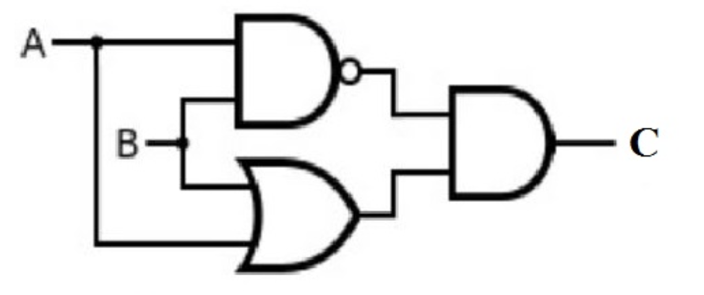

# Chapter 2 퍼셉트론

## 2.1 퍼셉트론이란?

- 뇌의 뉴런과 마찬가지로 입력을 받아서 뉴런의 공식에 따라서 출력 신호를 내보낸다.
- 이 장에서 설명하는 퍼셉트론은 입력을 받아 출력을 한다 (1), 안한다 (0)으로만 한다고 가정
- 입력신호노드에서 출력 신호 노드로 신호가 보내질 때 각각 고유의 가중치 **W** 가 존재함
- 예를 들어, 입력이 X<sub>1</sub>, X<sub>2</sub> 이고, 각 입력에 대한 가중치가 W<sub>1</sub>, W<sub>2</sub> 이고, 출력을 위한 임계치가 \theta 일때,
- y = 0 if X<sub>1</sub>W<sub>1</sub>, X<sub>2</sub>W<sub>2</sub> <= \theta, else 1 로 정의할 수 있다.

## 2.2 단순한 논리 회로

- AND, OR, NAND 등의 논리 게이트에 대한 진리표를 바탕으로 가중치와 임계치를 정의할 수 있다.
- 예를 들어 OR 게이트의 가중치는 (1, 1, 1), (0,5, 0.5, 0.5) 등 무한하게 정의 할 수 있다.
- 여기서 퍼셉트론의 매개변수 (가중치와 임계치 \theta)를 정의하는 것은 사람이다.
- **학습** 을 통해서 적절한 매개변수 값을 정할 수 있으며 사람이 매개변수를 정의하는 모델을 고민하여 컴퓨터에 학습을 수행할 데이터를 주는 일을 한다.

## 2.3 퍼셉트론 구현하기

### 2.3.1 단순 논리 게이트 회로 만들기

- AND 게이트는 아래와 같이 매우 간단하게 작성할 수 있다.

```python
def AND(x1, x2):
  w1, w2, theta = 0.5, 0.5, 0.7
  tmp = x1 * w1 + x2 * w2
  if tmp <= theta:
    return 0
  else:
    return 1
```

### 2.3.2 가중치와 편향 도입

- 앞서 정의했던 가중치 \theta를 조금 바구면 다시 식을 작성할 수 있는데, 이때 \theta를 b (bias, 편향)로 다시 정의해보자.
- y = 0 if b + X<sub>1</sub>W<sub>1</sub>, X<sub>2</sub>W<sub>2</sub> <= 0, else 1
- 식을 해석해보면 bias b 값을 입력 신호와 더하여 0보다 넘으면 1을 출력하도록 한다.

### 2.3.3 가중치와 편향을 도입한 AND 게이트

```python
import numpy as np

def AND(x1, x2):
  x = np.array([x1, x2])
  w = np.array([0.5, 0.5])
  b = -0.7
  tmp = np.sum(w*x) + b # numpy array multiply is elementwise if number of elements between two array is same
  if tmp <= 0:
    return 0
  else:
    return 1
```

- 가중치는 입력 신호에 영향력 (중요도)를 조절하는 요소
- 편향은 노드가 얼마나 쉽게 활성화 될 수 있도록 하느냐를 조절하는 요소
- NAND 게이트는 아래와 같이 구할 수 있다.

```python
import numpy as np

def NAND(x1, x2):
  x = np.array([x1, x2])
  w = np.array([-0.5, -0.5]) # Only weight and bias are different
  b = 0.7
  tmp = np.sum(w*x) + b
  if tmp <= 0:
    return 0
  else:
    return 1
```

- 코드를 통해 알 수 있듯이 가중치와 편향 값만 조절하여 게이트의 성격을 바꿀 수 있다.

## 2.4 퍼셉트론의 한계

### 2.4.1 XOR 논리 게이트

- XOR는 서로 다른 값이 입력으로 들어 왔을 때만 출력이 1이 되는 논리게이트 이다.
- 예를 들어 OR 게이트는 y = -0.5 +X<sub>1</sub> + X<sub>2</sub> 로 간단히 표현할 수 있다. (가중치 1, bias -0.5) 이때 그어지는 1차 함수 직선 아래는 0으로 위는 1로 간주할 수 있다.
- XOR 게이트는 이와 같이 직선으로 나타내거나 일정한 수식으로 나타내기가 어렵다. (직선 하나로 나누기란 불가능하다)

### 2.4.2 선형과 비선형

- 단 곡선으로 나눈다면 어떻게 영역 표시를 할 수는 있다.
- 문제는 그렇게 스바라시한 곡선을 표현하기는 어렵다는 것이다.
- OR 게이트의 수식과 같이 직선으로 표현이 가능한 영역을 **선형**, 곡선으로 표현이 가능한 영역을 **비선형** 으로 정의한다.

## 2.5 다층 퍼셉트론이 출동한다면

- 1개의 퍼셉트론으로는 XOR 게이트를 표현할 수 없었다.
- 하지만 여러개의 퍼셉트론을 쌓아서 시도해 볼 수 있다.
- 여러개의 퍼셉트론이 개층으로 쌓인 전체 퍼셉트론을 다층 퍼셉트론 (multi-layer perceptron)으로 정의한다.



- 위와 같이 XOR 게이트도 여러개의 게이트를 조합해서 구현이 가능하다.

```python
import numpy as np

def AND(x1, x2):
  x = np.array([x1, x2])
  w = np.array([0.5, 0.5])
  b = -0.7
  tmp = np.sum(w*x) + b # numpy array multiply is elementwise if number of elements between two array is same
  if tmp <= 0:
    return 0
  else:
    return 1

def NAND(x1, x2):
  x = np.array([x1, x2])
  w = np.array([-0.5, -0.5]) # Only weight and bias are different
  b = 0.7
  tmp = np.sum(w*x) + b
  if tmp <= 0:
    return 0
  else:
    return 1
  
def OR(x1, x2):
  x = np.array([x1, x2])
  w = np.array([0.5, 0.5]) # Only weight and bias are different
  b = 0.5
  tmp = np.sum(w*x) + b
  if tmp <= 0:
    return 0
  else:
    return 1
  
def XOR(x1, x2):
  S1 = NAND(x1, x2)
  S2 = OR(x1, x2)
  return AND(S1, S2)
```

- XOR 함수에서 입력 받은 x1, x2를 다층 레이어 퍼셉트론의 0층이라고 하며, S1, S2를 1층 마지막 결과를 2층으로 차례대로 계층화 할 수 있다.
- 0층의 신호가 개개의 퍼셉트론을 거쳐서 1층으로 전달되고, 1층 퍼셉트론을 거친 값들이 2층의 퍼셉트론으로 전달되어 결과 값을 얻는 방식이다.
- 이처럼 단층 퍼셉트론으로 표현할 수 없는 비선형적 내용들을 여러개의 개층으로 쌓아서 표현해 낼 수 있다.

## 2.6 NAND에서 컴퓨터까지

- 위처럼 여러개의 퍼셉트론을 통해서 표현하면 복잡한 회로를 만들 수 있다.
- 이론적으로 NAND게이트로 컴퓨터를 만들 수 있으니, 다층 퍼셉트론으로 컴퓨터를 만들 수 있다라는 의미도 된다!
- 그러나 복잡한 일을 수행하는 퍼셉트론을 만들려면 가중치와 편향 값을 **잘 조절**해야하는 문제가 발생한다.
- 여러개의 간단한 퍼셉트론을 모듈화 해서 만든 다음 조립하는 방식이 합리적이다.