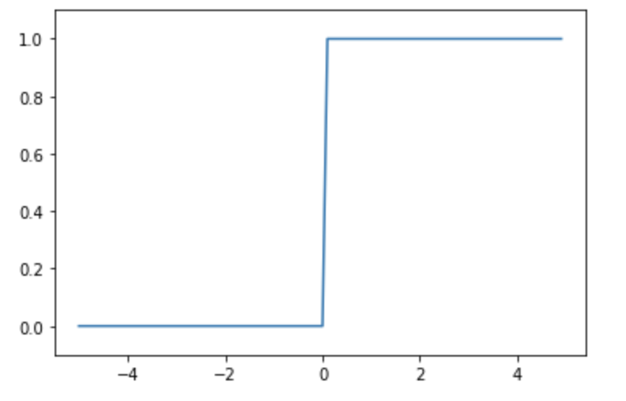
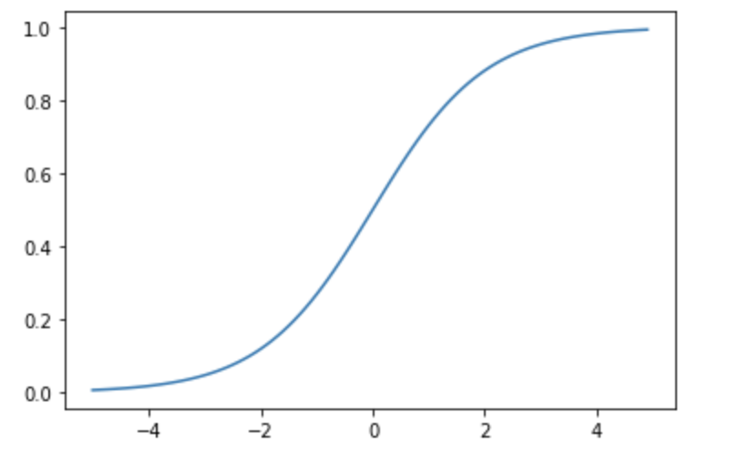
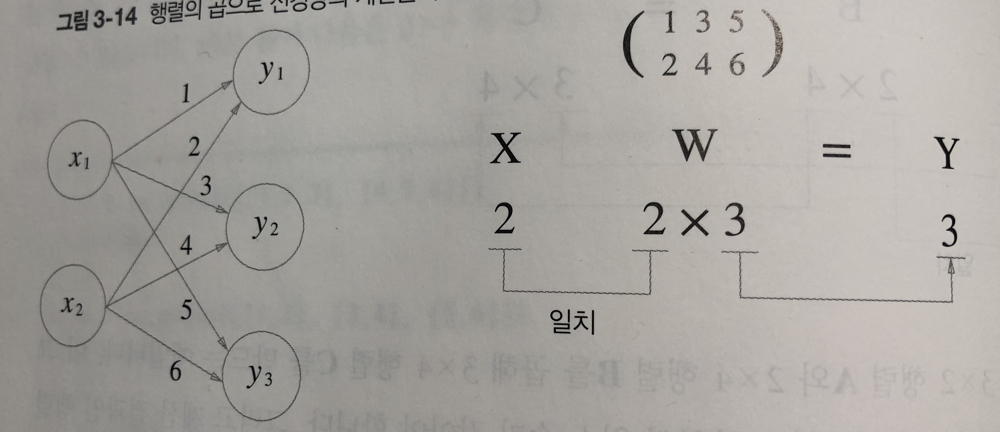

# Chapter 3 신경망

- 퍼셉트론은 복잡한 함수도 표현할 수 있었지만, 각 가중치를 선정하는 작업은 사람이 직접 수동으로 해야하는 부담이 있음.
- 신경망에서는 가중치를 자동으로 학습하는 능력이 중요한 성질로 있음.
- 이번 챕터에서는 신경망에 대한 내용을, 다음 챕터에서는 어떻게 가중치를 학습하는지 Araboza

## 3.1 퍼셉트론에서 신경망으로

### 3.1.1 신경망의 예

- 신경망은 가장 첫 층을 **입력층**, 중간 층을 **은닉 층**, 마지막으로 결과가 나오는 층을 **출력 층**으로 정의한다.
- 보통 신경망은 3개 층 (0층의 입력층, 1층의 은닉층, 2층의 출력층)으로 구성을 하지만 가중치를 갖는 층은 2개 (0 -> 1층, 1 -> 2층)뿐이기 때문에 2층 신경망으로 정의하기도 한다.

### 3.1.2 퍼셉트론 복습

- 퍼셉트론 식에서 y = 0 if W<sub>1</sub>X<sub>1</sub> + W<sub>2</sub>X<sub>2</sub> + b <= 0, else 1 에서, b에 대한 입력층의 신호는 항상 1로 나타낼 수 있다.
- 즉 X<sub>1</sub>, X<sub>2</sub>와 1이 입력층의 입력으로 제공되는 것을 의미
- 가중치와 편향에 대한 퍼셉트론 식을 h(X)로 정의를 해보면,
- y = h(x) , if x <= 0, then 0, else 1 로 정의할 수 있다. 입력 신호에 대하여 h 함수는 신호 값이 0보다 크면 1을, 0보다 작거나 같으면 0을 되돌려 주게 되는 함수로 다시 정의할 수 있다.

### 3.1.3 활성화 함수의 등장

- h(x)를 함수라고 하였는데, 입력 신호의 총합을 출력 신호로 변환해주는 함수를 일반적으로 **활성화 함수** (activation function)이라고 한다. 활성화라는 뜻은 이름 그대로 입력신호의 총 합이 활성화를 일으키는지를 결정하는 역할을 수행
- 입력신호의 총합을 a라고 할 때, 출력값 y는 h(a), 활성화 함수에 입력으로 입력 신호의 총합을 넣는 것으로 표현할 수 있다.
- 일반적으로 단층 퍼셉트론은 계단 함수 (step function)을 써서 임계점을 넘어가면 값이 바뀌는 것을 의미하고, 다층 퍼셉트론은 신경망으로 여러층으로 구성되며 시그모이드 함수 등의 계단 함수가 아닌 함수를 사용한다.

## 3.2 활성화 함수

- Step function 이외의 활성화 함수를 사용하는 것은 신경망의 세계로 나아가는 열쇠!

### 3.2.1 시그모이드 함수

- 가장 자주 사용되는 함수

$$h(x) = {1 \over 1 + exp(-x) } $$ 로 표현할 수 있다.

- 시그모이드 함수는 얼핏 보면 복잡해 보이지만 가장 간단한 함수!
- 신경망에서는 시그모이드 함수를 이용하여 입력을 변환하고 다음 노드에게 전달한다.

### 3.2.2 계단 함수 구현하기

```python
def step_function(x):
  if x > 0:
    return 1
  else:
    return 0
```

- 위의 코드는 x가 정수 혹은 실수인 경우에는 적용 가능하지만, 배열인 경우에는 적용하기 어렵다.

```python
import numpy as np

def step_function(x):
  y = x > 0
  return y.astype(np.int)

# >>> x = np.array([1.0, -0.5, 0.5])
# >>> y = x > 0
# >>> y
# array([True, False, True])
# >>> y.astype(np.int)
# array([1, 0, 1])
```

- astype 메소드를 황용하여 자료형을 변환해서 True는 1로, False는 0으로 치환하였다.

### 3.2.3 계단 함수의 그래프

- matplotlib을 활용해서 그래프를 그려보자

```python
import numpy as np
import matplotlib.pylab as plt

def step_function(x):
  return y.astype(x > 0, dtype = np.int)

x = np.arange(-5.0, 5.0, 0.1) # From -5, to 5 by 0.1
y = step_function(x)
plt.plot(x, y)
plt.ylim(-0.1, 1.1) # set y axis limit
plt.show()
```

- 다음과 같이 그려진다



### 3.2.4 시그모이드 함수 구현하기

```python
def sigmoid(x):
  return 1 / (1 + np.exp(-x))
```

- 위의 코드는 numpy 배열이 입력으로 들어오더라도 문제없이 동작한다.
- sigmoid 함수도 그려보자

```python
def sigmoid(x):
    return 1 / (1 + np.exp(-x))

y = sigmoid(x)
plt.plot(x,y)
plt.ylim(-0.1, 1.1)
plt.show()
```



### 3.2.5 시그모이드 함수와 계단 함수 비교

- 계단함수와 시그모이드 함수의 차이는 무엇일까?
  - 아마 매끄러움의 차이이다. 계단 함수는 각이 있는 직선인것에 비해 시그모이드는 매끄러운 곡선이다.
- 시그모이드의 곡선이 신경망 학습에서 아주 중요하다.
- 즉, 시그모이드는 step function과 다르게 실수를 값으로 보낸다.
- 이외에도 값이 적으면 적을수록 0에 수렴하고 반대의 경우에는 1로 수렴한다는 점이 공통점이다.

### 3.2.6 비선형 함수

- 시그모이드의 곡선, step function의 직각 등은 **비선형 함수**로 분류된다.
- 신경망에서는 비선형 함수를 활성화 함수로 사용해야한다.
  - 선형함수를 사용하면 신경망을 사용하는 의미가 사라진다.
- 선형함수의 문제점은 아무리 층을 깊게해도 단층 함수로도 동일한 기능을 할 수 있게 됨과 같다.
  - 예를 들어, y = ax 라는 활성화 함수가 있을 때, 3층으로 한다 한들 y = a<sup>3</sup>x 에 불과하다.

### 3.2.7 ReLU 함수

- 시그모이드를 오래전부터 많이 사용했지만 최근에는 ReLU (Rectified Linear Unit, 렐루) 함수를 주로 사용한다.
- ReLU는 입력이 0을 넘으면 그대로 입력을 주고, 이하면 0을 출력하는 함수이다.

```python
def relu(x):
  return np.maximum(0, x)
```

- np의 maximum을 사용해서 0과 x중 큰 값을 출력하도록 구현할 수 있다.

## 3.3 다차원 배열의 계산

- numpy의 배열 계산을 숙달해서 신경망 계산을 효율적으로 할 수 있다.

### 3.3.1 다차원 배열

- N차원 배열을 통틀어서 다차원 배열이라고 칭함
- 배열의 차원은 np.ndim() 함수를 통해서 확인할 수 있다.

```python
B = np.array([1,2], [3,4], [5,6])
print(B)
'''
>>> [[1 2]
     [3 4]
     [5 6]]
'''
np.ndim(B)
'''
>>> 2
'''
```

- 3 * 2 배열인 B, 처음 차원에는 원소가 3개, 다음에는 원소가 2개 있다는 의미
- 처음 차원은 0번째 차원, 다음 차원은 1번째 차원에 대응된다.
- 2차원 배열은 특별히 행렬, matrix라고 하며, 가로 방향을 행 (row), 세로 방향을 열 (column)이라고 한다.

### 3.3.2 행렬의 곱

- 2차원 배열 (행렬)은 왼쪽 행렬의 행(가로)와 오른쪽 행렬의 열(세로)를 원소별로 곱한 다음 그 값을 더해서 계산한다.
  - 예를 들어, 행렬 2개 A,B가 있을 때, A의 1행과 B의 1열을 각각 원소별로 곱해서 더한 값은 새로운 행렬 C의 1행, 1열의 값이 된다.
  - 같은 원칙으로 A의 2행과 B의 1열을 각각 곱한 값의 합은 C의 2행 1열의 값이 된다.

```python
A = np.array([1,2], [3,4])
B = np.array([5,6], [7,8])
np.dot(A, B) # dot == multiply

'''
>>> array([19, 22],
          [43, 50])
'''
```

- 단 행렬을 곱할 때에는 행렬의 형상(shape)에 주의하여 수행해야 한다.
- 구체적으로는 A * B 일 때, A의 열 수와, B의 행 수가 일치해야한다.

### 3.3.3 신경망에서의 행렬 곱



- 하나의 노드에서 다음 노드로의 신경망을 행렬로 표현할 수 있다.
- X와 W와 Y 행렬의 형상을 주의깊게 살펴보자
- 특히 X와 W의 행렬의 차원 원소가 같아야 한다는 것을 주의해야한다.
- numpy의 dot 메소드를 활용해서 행렬 연산을 단번에 수행할 수 있다.

## 3.4 3층 신경망 구현하기

### 3.4.1 표기법 설명

- w<sub>12</sub>, a<sub>1</sub> 와 같이 특정 원소를 지칭 할 수 있다.
- 예를 들어 w<sub>12</sub><sup>(1)</sup> 는 1층의 가중치이며 앞층의 2번째 뉴런 (x<sub>2</sub> 에서 다음층의 첫번째 뉴런 a<sub>1</sub> 으로 갈 때의 가중치라는 것으로 표현 할 수 있다)

### 3.4.2 각 층의 신호 전달 구현하기

- 입력이 2개 x<sub>1</sub>, x<sub>2</sub> 와 편향 b가 존재 할 때 중간층 으로의 값 a<sup>(1)</sup><sub>1</sub> 은 아래와 같이
  - $$a^{(1)}_1 = {w^{(1)}_{11} x_1 + w^{(1)}_{12} x_2 + b^{(1)}_{1}} $$ 으로 정의할 수 있다.
  - 여기서 행렬로 간단하게 정리하면, $$A^{(1)} = {XW^{(1)} + B^{(1)}} $$ 으로 정의 할 수 있다.
- 이를 코드로 나타내 보면,

```python
X = np.array([1.0, 0.5])
W1 = np.array([[0.1, 0.3, 0.5], [0.2, 0.4, 0.6]])
B1 = np.array([0.1, 0.2, 0.3])

A1 = np.dot(X, W1) + B1
```

- 이제 각 은닉층에 활성화 함수 처리를 해야 한다.

```python
Z1 = sigmoid(A1)
```

- sigmoid는 앞에서 정의한 함수
- 1층에서 2층으로 가는 작업도 동일하게 수행

```python
W2 = np.array([[0.1, 0.4], [0.2, 0.5], [0.3, 0.6]])
B2 = np.array([0.1, 0.2])

A2 = np.dot(Z1, W2) + B2
Z2 = sigmoid(A2)
```

- 입력이 기존에 X 배열에서 Z1 (1층에서 활성화 함수까지 거친 값)으로 사용한다는 것 외에는 동일
- 마지막 출력 함수로는 항등 함수 (identity function) 을 사용해서 출력 해보자

```python
def identity_function(x):
  return x

W3 = np.array([[0.1, 0.3], [0.2, 0.4]])
B3 = np.array([0.1, 0.2])

A3 = np.dot(Z2, W3) + B3
Y = identity_function(A3) # or Y = A3
```

- 출력층의 함수는 풀고자 하는 문제의 성질에 맞게 정의한다.
  - 예를 들어 회귀 문제에는 항등 함수, 2클래스(binary) 분류에는 시그모이드, 다중 분류에는 소프트 맥스를 사용하는 것이 일반적

### 3.4.3 구현 정리

```python
import numpy as np

def sigmoid(x):
  return 1 / (1 + np.exp(-x))

def init_network():
  network = {}
  network['W1'] = np.array([0.1, 0.3, 0.5], [0.2, 0.4, 0.6])
  network['b1'] = np.array([0.1, 0.2, 0.3])
  network['W2'] = np.array([0.1, 0.4], [0.2, 0.5], [0.3, 0.6])
  network['b2'] = np.array([0.1, 0.2])
  network['W3'] = np.array([0.1, 0.3], [0.2, 0.4])
  network['b3'] = np.array([0.1, 0.2])
  
  return network

def forward(network, x):
  W1, W2, W3 = network['W1'], network['W2'], network['W3']
  b1, b2, b3 = network['b1'], network['b2'], network['b3']
  
  a1 = np.dot(x, W1) + b1
  z1 = sigmoid(a1)
  a2 = np.dot(z1, W2) + b2
  z2 = sigmoid(a2)
  a3 = np.dot(z2, W3) +b3
  y = a3 # identity function
  
  return y

if __name__ == "__main__":
  network = init_network()
  x = np.array([1.0, 0.5])
  y = forward(network, x)
```

- 전파에 사용한 메소드 이름을 forward 라고 명명
  - 방향이 입력에서 출력으로의 순 방향이기 때문
  - 이후에 신경망을 학습시킬 때에는 입력층으로 되돌아가는 역방향 backward 함수를 정의할 것

## 3.5 출력층 설계하기

- 회귀와 분류 문제 모두에 사용 가능하지만, 어떤 문제냐에 따라서 출력층에서 사용하는 함수가 달라진다.
- 회귀 (regression) 문제에는 항등함수를, 분류 (classification) 문제에는 소프트맥스 함수를 사용한다.

### 3.5.1 항등 함수와 소프트맥스 함수 구현하기

- 항등 함수 (identity_function)
  - 입력 그대로 출력
- 소프트맥스 함수 (softmax function)
  - 분류에 많이 사용
  - $$y_k = {exp(a_k) \over \sum_{i=1}^n exp(a_n)} $$ 으로 표현됨
  - n은 출력층의 뉴런 수, $$y_k$$ 는 k번째 출력
  - 소프트맥스 함수는 입력층의 모든 값으로 부터 입력을 받음

```python
def softmax_function(a):
  exp_a = np.exp(a) # apply all exponential function
  sum_exp_a = np.sum(exp_a)
  y = exp_a / sum_exp_a
  return y
```

### 3.5.2 소프트맥스 함수 구현시 주의점

- Overflow 문제 소지가 있음
- $$ e^{1000} $$ 은 거의 inf 값이 되어 제대로 계산이 되지 않을 우려가 있음
- 이에 임의의 정수 C를 분자 분모에 곱하고 식을 변환하여 아래와 같이 식을 얻을 수 있다.
- $$ y_k = {Cexp(a_k) \over C\sum_{i=1}^n exp(a_n)} = {exp(a_k + logC) \over \sum_{i=1}^n exp(a_i + logC)} = {exp(a_k+C') \over {\sum_{i=1}^n exp(a_i + C')}} $$
- 소프트맥스 함수의 지수 함수를 어떤 값을 대입해도 결과는 바뀌지 않는다는 것
- 여기에서 사용하는.  C' 값은 어떤 값을 대입해도 상관 없지만, 일반적으로 입력 값 중의 최대 값을 사용한다.
  - 의미 없는 값을 사용해서 오버플로를 막기 위한 목적

```python
def softmax(a):
	c = np.max(a)
  exp_a = np.exp(a - c) # prevent overflow
  sum_exp_a = np.sum(exp_a)
  y = exp_a / sum_exp_a
  return y
```

### 3.5.3 소프트맥스 함수의 특징

- Softmax 함수는 값이 0-1 사이의 실수가 값으로 선정됨
- 출력 값의 총합은 1이 됨
  - 이 때문에 소프트맥수 함수의 출력을 '확률'로 해석할 수 있음
  - 예를 들어, 소프트맥수 함수의 출력 값이 0.1, 0.3, 0.6인 경우 0.6의 값을 가진 출력이 가장 확률이 높으므로 분류에서 해당 값의 출력으로 분류 한다 등으로 사용이 가능함

### 3.5.4 출력층의 뉴런 수 정하기

- 출력층 뉴런 수는 풀고자 하는 문제에 따라서 적절하게 선정
  - 예를 들어 손글씨 0-9 중에 어떤 숫자인지 분류하는 문제라면 출력층의 갯수는 10개가 됨

## 3.6 손글씨 숫자 인식

- 학습 과정은 생략하고 추론 과정만 사용
- 추론 과정을 신경망의 순전파 (forward propagation)이라고 함

### 3.6.1 MNIST 데이터셋

- 가장 널리 사용됨
- 0부터 9까지의 숫자 이미지로 구성
- https://github.com/oreilly-japan/deep-learning-from-scratch/blob/master/dataset/mnist.py 에 정의 되어 있는 파일을 불러와서 사용

### 3.6.2 신경망의 추론 처리

- 입력층 뉴런을 784개 (28 * 28 pixcel), 출력층 뉴런을 10개 (0-9 숫자)로 정의
- 은닉층은 임의로 1층은 50개, 2층은 100개로 정의

```python
import sys, os
sys.path.append(os.pardir)
import numpy as np
from mnist import load_mnist
from PIL import Image
import pickle

def get_data():
  (x_train, t_train), (x_test, t_test) = \
  load_mnist(normalize = True, flatten = True, one_hot_label = False)
  return x_test, t_test

def init_network():
  with open("sample_weight.pk1", 'rb') as f:
    network = pickle.load(f) # pickle == load from file python object
    
  return network

def predict(network, x):
  W1, W2, W3 = network['W1'], network['W2'], network['W3']
  b1, b2, b3 = network['b1'], network['b2'], network['b3']
  
  a1 = np.dot(x, W1) + b1
  z1 = sigmoid(a1)
  a2 = np.dot(z1, W2) + b2
  z2 = sigmoid(a2)
  a3 = np.dot(z2, W3) + b3
  y = softmax(a3)
  
  return y
```

- pickle 파일인 sample_weight.pkl (https://github.com/oreilly-japan/deep-learning-from-scratch/blob/master/ch03/sample_weight.pkl) 을 사용함
- 이제 세 함수를 활용해서 정확도 (accuray)를 평가해보자

```python
x, t = get_data()
network = init_network()

accuracy_cnt = 0
for i in range(len(x)):
  y = predict(network, x[i])
  p = np.argmax(y)
  if p == t[i]:
    accuracy_cnt += 1
    
print("Accuracy: " + str(float(accuracy_cnt) / len(x)))

'''
>>> Accuracy: 0.9352
'''
```

- normalize를 통해서 0~255 범위인 픽셀 값을 0~1 사이의 값으로 변환하였다.
- 이렇게 특정 범위로 데이터를 변환하는 처리를 정규화 (normalize)라고 하고, 이러한 변환의 과정을 전처리 (pre-processing)이라고 한다.

### 3.6.3 배치처리

- 위의 예제는 한번에 한장씩 사진을 입력하여 처리를 진행하였다.
- 여러장을 한꺼번에 처리하는 경우를 생각해보자
  - 예를 들어 100장의 분량을 한번에 처리한다면, 입력 벡터 x의 모양은 100 * 784 의 행렬이 되어야 할 것이고, 출력은 100 * 10 이 될 것이다.
  - x[0], y[0]은 0번째 이미지 값과 추론 결과가 있는 식이다.

```python
x, t = get_data()
network = init_network()

batch_size = 100
accuracy_cnt = 0

for i in rnage(0, len(x), batch_size):
  x_batch = x[i:i+batch_size]
  y_batch = predict(network, x_batch)
  p = np.argmax(y_batch, axis = 1) # axis=1 means find maximum value based on first axis
  accuracy_cnt += np.sum(p == t[i:i+batch_size])
```


