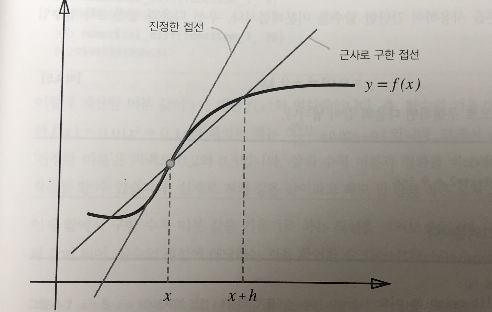

# Chapter 4. 신경망 학습

- 학습
  - 훈련 데이터에서 가중치 매개변수 최적값을 자동으로 획득하는 것
  - 학습을 위해서는 어떻게 가중치를 조절해야하는지 알아야 함
  - 이 때 사용하는 지표가 손실 함수

## 4.1 데이터에서 학습한다!

- 신경망의 특징은 데이터를 보고 학습할 수 있다는 점
  - 가중치 매개변수의 값을 데이터를 보고 자동으로 결정한다
  - 실제 신경망은 매개변수가 수천, 수만개이기 때문에 하나씩 결정해 주는 것은 매우 불가능

### 4.1.1 데이터 주도 학습

- 데이터에서 답을 찾고, 패턴을 발견하고 이야기를 만드는 작업 -> 기계학습
- 데이터가 없으면 기계학습을 수행할 수 없음
- 어떠한 문제를 풀 때 사람이 가설을 세우고 패턴을 찾아내고 하는 일반적인 문제 해결방법과 달리 기계학습은 사람의 개입을 최소화하고 수집한 데이터에서 패턴을 찾으려 시도
  - 신경망과 딥러닝은 기존 기계학습보다 더 사람의 개입을 배제함
- 예를 들어, 손글씨 숫자 5를 구별하는 알고리즘을 설계한다.
  - 사람이라면 쉽게 인식하지만, 숨은 규칙성을 발견해서 로직으로 만들어 내기는 매우 어려움
  - 이미지에서 특징 (feature)을 추출하고 특징의 패턴을 기계학습 기술로 학습하는 방법
  - 하지만, 학습에 사용할 특징을 어떤 것을 사용해야 하는가에 대하여는 여전히 '사람'이 개입해야하는 여지가 있음
  - 딥러닝 등의 심층 기계학습 기법은 특징을 고르는 방법 자체도 사람이 아닌 학습 방법에서 추출, 선정
- 일반 알고리즘
  - 사람이 생각한 알고리즘 -> 결과
- 일반적인 기계학습
  - 사람이 생각한 특징 -> 기계학습 -> 결과
- 딥러닝 (종단간 기계학습, 처음부터 끝까지 모두 사람의 개입이 없음)
  - 신경망 (딥러닝 알고리즘) -> 결과
- 신경망의 장점은 어떤 문제든지 관계 없이 문제를 해결할 수 있다는 점에 있음

### 4.1.2 훈련 데이터와 시험 데이터

- 기계학습 문제는 데이터를 훈련 데이터 (training data)와 시험 데이터 (test data)로 나누어서 학습과 실험을 수행하는 것이 일반적
- 훈련 데이터로 최적의 매개변수를 찾아낸 뒤, 실험 데이터의 답을 찾아내는 모델
  - 범용적으로 사용하기 위해서 데이터를 나누어서 평가해야함
  - 범용능력을 평가하기 위해서 훈련데이터와 시험데이터를 분리하는 것
    - 범용능력: 아직 보지 못한 데이터를 올바르게 풀어내는 능력
- 특정 데이터 셋에 편중되어 학습을 수행하면 해당 데이터 셋에 대한 답은 정확하게 맞출 수 있어도, 다른 데이터 셋은 정확하게 맞추지 못하는 오버피팅(overfitting)문제가 발생 할 수 있음

## 4.2 손실 함수

- 신경망 학습에서는 현재의 상태를 '하나의 지표'로 표현
  - 그리고 이 지표를 가장 좋게 만들어주는 가중치 매개변수의 값을 탐색하는 것
- 신경망에서 사용하는 지표는 손실 함수 (loss function)이라고 정의
  - 얼마나 성능이 나쁜가에 대한 정도를 나타냄
  - 일반적으로 평균 제곰 오차와 교차 엔트로피 오차를 사용

### 4.2.1 평균 제곱 오차

- 가장 많이 쓰이는 손실 함수
- $$E = {1 \over 2}\sum(y_k-t_k)^2 $$ 으로 표현한다.
  - y<sub>k</sub>는 출력 값, t<sub>k</sub>는 정답 레이블 값 k는 데이터의 차원 수

```python
>>> y = [0.1, 0.05, 0.6, 0.0, 0.05, 0.1, 0, 0.1 ...]
>>> t = [0, 0, 1, 0, 0, ...]
```

- 위의 경우, y 값은 소프트 맥스 함수를 통해서 출력한 각 값의 확률이라고 할 때, 정답은 t의 레이블 값이 1인 t[2]라고 하자.
  - (FYI) 한 원소만 1(정답)로 하고 그렇지 않은 값들은 0(오답)으로 나타내는 표기법을 원-핫 인코딩 이라고 한다.
- 이 경우 제곱 오차 값은
  - $${(0.1-0)^2 + (0.05-0)^2 + (0.6 - 1)^2 ...} \over 2$$ 으로 나타낼 수 있다.

```python
def mean_squared_error(y, t):
  return 0.5 * np.sum((y-t)**2)
```

- 오답으로 예상한 모델은 값이 높을 것이고, 정답에 높은 확률을 설정한 모델은 값이 낮을 것이다.

### 4.2.2 교차 엔트로피 오차

- Cross Entropy Error (CEE)
- $$E = - \sum {t_klog {y_k}}$$ 으로 표현
  - log는 자연 로그
  - 정답에만 해당하는 인덱스를 1로 표현하고 나머지는 0으로 인코딩하는 원-핫 인코딩 사용
  - 실질적으로는 정답일 때의 추정의 자연로그를 계산하는 식이 된다. (t<sub>k</sub>가 1일 때의 y<sub>k</sub>)
- 예를 들어, 정답 레이블 '2'의 출력이 0.6이라면,
  - 오차는 $$-log0.6 = 0.51 $$이 된다.
- 출력이 0.1 이라면
  - $$-log0.1= 2.30$$ 으로 정답일 떄의 출력이 전체 값을 정하게 된다.

```python
def cross_entropy_error(y, t):
  delta = 1e-7
  return -np.sum(t * np.log(y + delta))
```

- delta를 도입한 이유는 y 값이 0일 때 log 값이 -inf로 표현되기 때문에 이를 보정하기 위해서 delta를 사용

### 4.2.3 미니배치 학습

- 기계학습은 훈련 데이터를 사용해서 학습
  - 훈련 데이터를 사용하여 손실 함수의 값을 최소한으로 만드는 매개변수를 찾는 과정
- 이를 위해서는 모든 훈련 데이터를 대상으로 손실 함수의 값을 구해야한다.
- 모든 값에 대하여 손실함수의 합을 구하는 식은 다음과 같이 표현
  - $$E = {-{1\over N}}\sum_{i=0}^n \sum_{j=0}^k{t_{nk}logy_{nk}}$$
  - 데이터가 N개라면 t<sub>nk</sub>는 n번째 데이터의 k번째 값을 의미
  - 복잡해 보이지만 데이터 하나에 대한 손실 함수를 N개로 확장한것 뿐
  - 마지막에 N개로 나우어서 평균 손실 함수를 구하는 것.
- 예제에서 사용하는 MNIST 데이터는 훈련 데이터가 60,000 개임
  - 모든 데이터를 대상으로 손실 함수의 합을 구하려면 시간이 오래걸림
- 이런 경우 데이터를 일부 추려내서 전체의 '근사치'로 이용할 수 있음
- 신경망에서 일부 데이터로 훈련 데이터를 사용하여 골라 학습하는 것을 **미니 배치(mini-batch)**라고 정의함
  - 예를 들어, 60,000개의 데이터 중에서 100장을 무작위로 뽑아서 학습하는 것이라고 함

```python
import sys, os

sys.path.append(os.pardir)

import numpy as np
from mnist import load_mnist

(x_train, t_train), (x_test, t_test) = \
	load_mnist(normalize = True, one_hot_label = True)
  
print(x_train.shape) # (60000, 784)
print(t_train.shape) # (60000, 10)

train_size = x_train.shape[0] # 60000
batch-size = 10
batch_mask = np.random.choice(train_size, batch_size) # randomly select indecies from 0-59999
x_batch = x_train[batch_mask]
t_train = t_train[batch_mask]

'''
>>> np.random.choice(60000, 10)
array([8013, 14666, 58210, 10, 33333 ...])
'''
```

### 4.2.4 (배치용) 교차 엔트로피 오차 구현하기

```python
def cross_entropy_error(y, t):
  if y.ndim == 1: # if dimension of y is 1
    t = t.reshape(1, t_size)
    y = y.reshape(1, y_size)
    
  batch_size = y.shape[0]
  return -np.sum(t * np.log(y + 1e - 7))
```

- 만약 위와 같이 데이터가 원-핫 인코딩으로 정답만 1인 경우가 아니라면,

```python
def cross_entropy_error(y, t):
  if y.ndim == 1: # if dimension of y is 1
    t = t.reshape(1, t_size)
    y = y.reshape(1, y_size)
    
  batch_size = y.shape[0]
  return -np.sum(t * np.log(y[np.arange(batch-size), t] + 1e - 7))
```

- 원-핫 인코딩 일 때 t가 0인 원소는 교차 엔트로피 오차도 0이므로 해당 계산은 무시해도 좋다는 것이 핵심
- np.arrange(batch_size) method는 0부터 batch_size - 1 까지 배열 생성

### 4.2.5 왜 손실 함수를 설정하는가?

- 왜 정확도라는 실제 정답을 두고 손실함수를 사용해야 하는 것일까?
  - 신경망 학습에서의 '미분'의 역할에 주목하면 된다.
  - 최적의 매개변수를 탐색할 때 손실함수의 값을 가능한 작게 하는 값을 찾는다.
  - 이 때 매개 변수의 미분을 계산하고 그 미분 값을 단서로 매개변수를 서서히 갱신하는 과정을 반복
- 손실 함수의 미분이란
  - 가중치 매개변수의 값을 아주 조금 변화시켰을 때 손실 함수가 어떻게 변하는가
  - 음수라면 가중치 매개변수를 양의 방향으로 변화시켜 값을 줄일 수 있다.
  - 반대로 양수라면 매개변수 방향을 음의 방향으로 변화한다.
  - 미분 값이 0이라면 어느쪽으로도 움직이지 않는다.
- 정확도를 사용하기 어려운 이유는 이 미분값이 0으로 되어 양의 방향이나 음의 방향 모두 효과가 나타나지 않기 때문
- 예를 들어, 정확도가 32%인 모델이 있는 경우,
  - 조금 매개변수를 조정해도 32%가 나올 확률이 높다. 이 경우에는 미분을 하여도 증분이 0이기 때문에 학습을 수행하기 매우 어렵다.
- 이와는 다르게 손실함수의 값을 삼는 경우
  - 값이 0.9253... -> 0.9343... 식으로 변하기 때문에 값을 구하기 쉽다.

## 4.3 수치 미분

- 경사법 = 기울기 (경사) 값을 기준으로 나아갈 방향을 정함

### 4.3.1 미분

- 미분 = '특정 순간'의 변화량 (한 순간의 변화량)
- $${df(x)\over dx}=\lim_{h \to 0} {f(x+h)-f(x) \over h}$$
  - 함수의 미분
  - 시간의 작은 변화, 즉 시간을 뜻하는 h를 한없이 0에 가깝게 수행
- 이제 수치 미분 numerical differentiation 함수인 numerical_diff 메소드를 구현해보자

```python
def numerical_diff(f, x):
  h = 1e-4 # 0.0001
  return (f(x+h) - f(x-h)) / (2 * h)
```

- 왜 f(x+h) 와 f(x-h)의 차이를 사용해야 할까?



- 위의 그림과 같이 수치 미분에는 오차가 포함됨
- 오차를 줄이기 위해서 (x+h)와 (x-h) 일 때의 함수 f의 차분을 계산하는 방법을 쓰기도 함
- x를 중심으로 전후의 차분을 사용한다는 의미에서 중심 차분 혹은 중앙 차분이라고 함

### 4.3.2 수치 미분의 예

- 예를 들어, $$y=0.01x^2+0.1x$$ 라는 식이 있다고 하자.
- 실제 미분 식은 $${df(x) \over dx} = 0.02x + 0.01$$ 이다.
  - x가 5, 10일 때의 값은 0.2, 0.3 이 된다.
- 위의 수치 미분의 값에 의해서 계산된 x가 5, 10일 때의 값은 각각 0.1999999999... , 0.29999999... 이므로 거의 실제 해석미분 (식을 전개하여 얻은 미분 값)과 근사하다.

### 4.3.3 편미분

- $$ f(x_0, x_1) = x_0^2 + x_1^2$$ 와 같이 변수가 2개 이상인 식에 대하여 특정 변수를 기준으로 미분을 수행하는 것을 편미분이라고 한다.
- 예를 들어 x<sub>0</sub> 에 대하여 편미분을 수행할 때, x<sub>0</sub>=3, x<sub>1</sub>=4 일때, x<sub>0</sub> 에 대한 편미분 값은
  - $$ f(x_0) = x_0*x_0 + 4.0*2, {df(x_0) \over dx} = 2 * x_0, {df(3) \over dx} = 2 * 3 = 6 $$ 으로 편미분을 수행할 수 있으며,
  - 위의 수식에 대하여는 6.000000..378 으로 거의 근사한 값을 얻을 수 있다.

## 4.4 기울기

- 위의 4.3.3 절에서 편미분을 각 변수에 대하여는 쉽게 구할 수 있었다.
- 그렇다면 편미분을 동시에 하고 싶다면?
  - 이 경우 모든 변수의 편미분을 벡터로 정리한 것을 기울기 (gradient)라고 정의
- 기울기는 다음과 같이 구할 수 있다.

```python
def numerical_gradient(f, x):
  h = 1e-4 # 0.0001
  grad = np.zeros_like(x) # generate simlar shape on array x, but 0 values
  
  for idx in range(x.size):
    tmp_val = x[idx]
    x[idx] = tmp_val + h
    fxh1 = f(x)
    
    x[idx] = tmp_val-h
    fxh2 = f(x)
    
    grad[idx] = (fxh1 - fxh2) / (2 * h)
    x[idx] = tmp_val
  
  return grad
```

- 위의 수치 미분과 동일하게 매우 작은 차분을 계산하여 배열로 돌려주도록 구현
- 기울기는 가장 낮은 장소를 포인팅하도록 값이 계산된다.
  - 정학하게는 각 장소에서 함수의 출력 값을 가장 크게 줄이는 방향

### 4.4.1 경사법 (경사 하강법)

- 신경망에서는 매개변수의 범위가 (일반적으로) 광대함
  - 최적의 값을 찾기가 어려움
  - 이런 상황에서 기울기를 이용해서 오차가 최소인 지점을 찾아가는 방법
- 기울기를 사용해서 최솟값을 찾기 때문에 기울기가 가리키는 곳으로 이동 했을 때 정말로 최솟값이 있는지는 보장할 수 없음
- 경사법은 현 지점에서 기울어진 방향으로 일정거리만큼 이동한다.
  - 그런 다음 이동한 곳에서 마찬가지로 기울기를 구하고 기울어진 방향으로 나아가기를 반복
- 경사법을 수식으로 나타내보자
  - $$x_0 = x_0 - \eta{\partial f \over \partial x_0} $$
  - $$x_1 = x_1 - \eta{\partial f \over \partial x_1} $$
  - eta 값은 갱신하는 양을 나타낸다. 이를 신경망 학습에서는 학습률으로 표현
    - 한번에 얼마만큼 학습을 해야할지 정하는 값
  - 이 식을 여러번 반복하면서 함수의 값을 서서히 줄여나가는 것
- 학습률의 값은 일정 값으로 0.01, 0.001 등으로 미리 정해야함
  - 이 값이 너무 크거나 작으면 '좋은 장소'를 찾을 수 없음

```python
def gradient_descent(f, init_x, lr = 0.01, step_num = 100):
  # f: function to optimize, init_x: initial value
  # lr: learning rate, step_num: how many times to iterate
  x = init_x
  for i in range(step_num):
    grad = numerial_gradient(f, x)
    x -= lr * grad
  
  return x
```

- 학습률과 같은 매개변수를 하이퍼파라미터라고 한다.
  - 가중치와 편향 같은 신경망의 매개변수와는 성질이 다른 매개변수 (훈련 데이터와 학습 알고리즘에 의해서 자동으로 획득)
  - 하이퍼파라미터는 사람이 직접 매개변수를 설정해야함

### 4.4.2 신경망에서의 기울기

- 여기서의 기울기는 가중치 매개변수에 대한 손실 함수의 기울기

```python
import sys, os
sys.path.append(os.pardir)
import numpy as np

class simpleNet:
  def __init__(self):
    self.W = np.random.randn(2, 3) # init with normal distribution
    
  def predict(self, x):
    return np.dot(x, self.W)
  
  def loss(self, x, t):
    z = self.predict(x)
    y = softmax(z)
    loss = cross_entropy_error(y, t)
    
    return loss
```

- 이전에 정의한 소프트맥스 활성화 함수와 cross_entropy_error 함수를 사용하자

## 4.5 학습 알고리즘 구현하기

- 신경망 학습의 절차는 다음과 같다
  - 전체: 신경망에는 적응 가능한 가중치와 편향이 있고, 이를 훈련데이터로 조정하는 과정이 학습
  - 1단계: 미니 배치 (훈련 데이터 일부를 가져오기)
  - 2단계: 기울기 산출 (손실 함수의 값을 줄이기 위해서 기울기를 구함)
  - 3단계: 매개변수 갱신 (가중치 방향으로 아주 조금 갱신)
  - 4단계: 1~3단계를 반복한다.
- 경사 하강법으로 매개변수를 갱신하는 방법으로 미니배치를 통해서 무작위로 데이터를 가져오기 때문에 확률적 경사 하강법 (stochastic gradient descent, SGD)라고 부른다

### 4.5.1 2층 신경망 클래스 구현하기

```python
import sys, os
sys.path.append(os.pardir)
import numpy as np

class TwoLayerNet:
  def __init__(self, input_size, hidden_size, output_size, weight_init_std = 0.01):
    self.params = {}
    self.params['W1'] = 
      weight_init_std * np.random.randn(input_size, hidden_size)
    self.params['b1'] = np.zeros(hidden_size)
    self.params['W2'] = 
      weight_init_std * np.random.randn(input_size, output_size)
    self.params['b2'] = np.zeros(output_size)
    
  def predict(self, x):
    W1, W2 = self.params['W1'], self.params['W2']
    b1, b2 = self.params['b1'], self.params['b2']
    
    a1 = np.dot(x, W1) + b1
    z1 = sigmoid(a1)
    a2 = np.dot(z1, W2) + b2
    y = softmax(a2)
    
    return y
  
  def loss(self, x, t):
    y = self.predict(x)
    
    return cross_entropy_error(y, t)
  
  def accuracy(self, x, t):
    y = self.predict(x)
    y = np.argmax(y, axis = 1)
    t = np.argmax(t, axis = 1)
    
    accuracy = np.sum(y == t) / float(x.shape[0])
   	return accuracy
  
  def numerical_gradient(self, x, t):
    loss_W = lambda W: self.loss(x, t)
    
    grads = {}
    grads['W1'] = numerical_gradient(loss_W, self.parmas['W1'])
    grads['b1'] = numerical_gradient(loss_W, self.parmas['b1'])
    grads['W2'] = numerical_gradient(loss_W, self.parmas['W2'])
    grads['b2'] = numerical_gradient(loss_W, self.parmas['b2'])
    
    return grads
```

### 4.5.2 미니배치 학습 구현하기

```python
import numpy as np
from mnist import load_mnist

(x_train, t_train), (x_test, t_test) = \
  load_mnist(normalize=True, one_hot_label = True)
  
train_loss_list = []

iters_num = 10000
train_size = x_train.sahpe[0]
batch-size = 100
learning_rate = 0.1

network = TwoLayerNetwork(input_size = 784, hidden_size = 50, output_size = 10)

for i in range(iters_num):
  batch_mask = np.random.choice(train_size, batch_size)
  x_batch = x_train[batch_mask]
  t_batch = t_train[batch_mask]
  
  grad = network.numerical_gradient(x_batch, t_batch)
  
  for key in ('W1', 'b1', 'W2', 'b2'):
    network.parmas[key] -= learning_rate * grad[key]
    
  loss = network.loss(x_batch, t_batch)
  train_loss_list.append(loss)
```

- 학습 횟수가 늘어나면서 오차가 점점 수렴해 갈 것이다.

### 4.5.3 시험 데이터로 평가하기

- 손실 함수의 값이 점점 작아지는 것은 확인할 수 있지만, 다른 데이터에서도 동일한 성능을 내는지는 아직 확인하지 못했다.
- 훈련 데이터 외의 데이터를 올바르게 인식하는지 확인해야 한다.
  - 오버 피팅의 문제가 없는지를 확인해야함

```python
import numpy as np
from mnist import load_mnist

(x_train, t_train), (x_test, t_test) = \
  load_mnist(normalize=True, one_hot_label = True)
  
train_loss_list = []
train_acc_list = []
test_acc_list = []

iter_per_epoch = max(train_size / batch_size, 1)

iters_num = 10000
train_size = x_train.sahpe[0]
batch-size = 100
learning_rate = 0.1

network = TwoLayerNetwork(input_size = 784, hidden_size = 50, output_size = 10)

for i in range(iters_num):
  batch_mask = np.random.choice(train_size, batch_size)
  x_batch = x_train[batch_mask]
  t_batch = t_train[batch_mask]
  
  grad = network.numerical_gradient(x_batch, t_batch)
  
  for key in ('W1', 'b1', 'W2', 'b2'):
    network.parmas[key] -= learning_rate * grad[key]
    
  loss = network.loss(x_batch, t_batch)
  train_loss_list.append(loss)
  
  if i % iter_per_epoch == 0:
    train_acc = network.accuracy(x_train, t_train)
    test_acc = network.accuracy(x_test, t_test)
    train_acc_list.append(train_acc)
    test_acc_list.append(test_acc)
    print("teain acc, test acc | " + str(train_acc) + ", " + str(test_acc))
```

