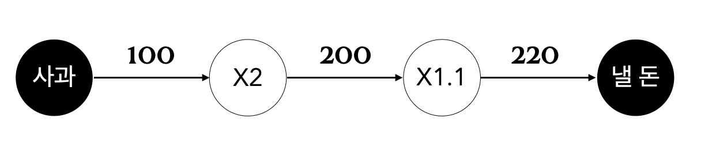
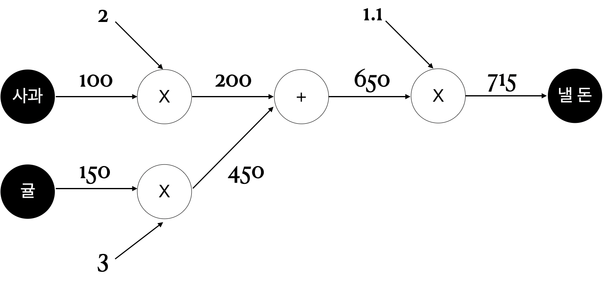
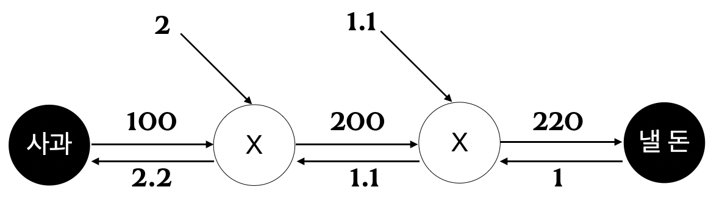
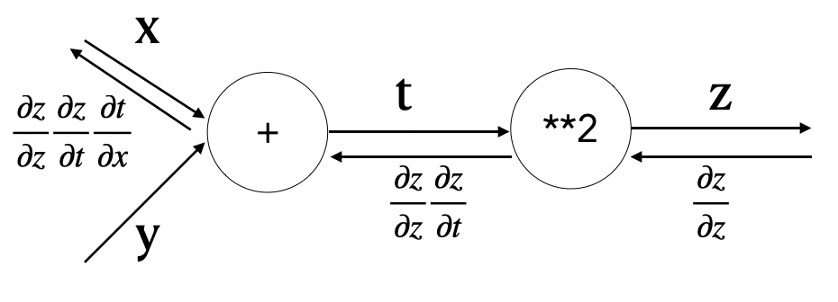
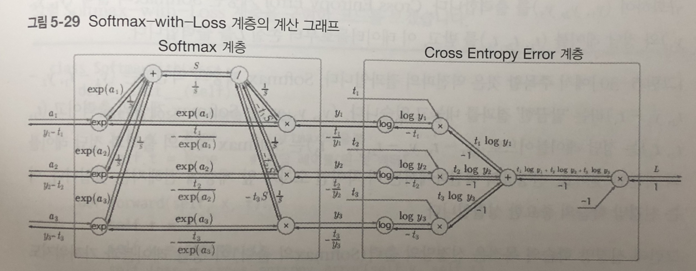

# Chapter 5 오차역전파법

- 이전 챕터에서 기울기 경사법을 사용해서 매개변수의 최적값을 찾으려고 시도했음
  - 이때 수치 미분을 사용, but 단순하지만 오래 걸림
- 기울기를 효율적으로 계산하는 오차역전파법 (backpropagation)을 araboza
- 오차역전파법은 수식을 통하거나 계산 그래프를 통해서 이해할 수 있다.
  - 수식은 본질을 놓치거나 너무 많은 수식에 당황할 수 있으니 계산 그래프를 사용해서 이해해보자.

## 5.1 계산 그래프

- 계산 그래프 (computational graph)는 계산 과정을 그래프로 나타낸 것
  - 그래프는 자료구조로 복수의 노드와 엣지로 표현

### 5.1.1 계산 그래프로 풀다

- 간단한 문제를 계산 그래프로 풀어보자
- 예를 들어, A군이 슈퍼에서 1개에 100원인 사과 2개를 샀다. 부가세 10%를 포함한다고 할 때, 지불 금액은?



- 위의 그래프처럼 처음 사과 100원이 'X2' 노드로 이어지고, 200원이 되어 다시 부가세 'X1.1'의 그래프로 흐르게 되어 최종 답은 220원이 된다.
- "A군이 사과를 2개, 귤을 3개 샀고, 사과는 1개의 100원, 귤은 150원이며, 부가세 10%를 포함한다면 지불 금액은?"



- 덧셈 노드 +를 추가했고, 곱셈 노드와 수치 입력을 분리했다.
- 회로에 전류가 흐르듯 왼쪽에서 오른쪽으로 계산 결과가 흐르게 되며, 마지막 노드로 가게 되면 끝이 나게 된다.
- 문제 풀이는
  - 계산 그래프를 구성한다
  - 그래프를 왼쪽에서 오른쪽으로 진행한다.
- 여기서 왼쪽에서 오른쪽으로 진행하는 단계를 순전파(forward propagation)이라고 한다.
- 반대방향은 역전파(backward propagation)이라고 정의한다.
  - 역전파는 미분을 계산할 때 중요한 역할을 한다.

### 5.1.2 국소적 계산

- 계산 그래프의 특징은 '국소적(자신과 직접 관계된 작은 범위) 계산을' 전파함으로써 최종 결과를 얻는다는 점에 있다.
- 결국 전체에 어떤 일이 벌어지든 상관 없이 자신과 관계된 정보만으로 결과를 출력할 수 있다는 것
- 위의 사과와 귤의 계산에서 사과는 그 외의 노드가 어떻게 계산 되었는지 (귤의 가격과 그 합이 어떤지)는 신경쓸 필요 없이, 덧셈 노드로 자신의 계산 값을 전달해주기만 하면 된다.
- 이것이 국소적 계산이라고 하며, 결과를 전달함으로써 전체를 구성하는 복잡한 계산을 해낼 수 있다.

### 5.1.3 왜 계산 그래프로 푸는가?

- 계산 그래프를 사용하므로써
  - '국소적 계산'으로 문제를 단순화 할 수 있다.
  - 중간 계산 결과를 보관할 수 있다.
  - 가장 큰 이유는 '미분'을 효율적으로 계산할 수 있다는 점
  - 사과 문제로 돌아가서 사과 가격(x)이 오르면 최종 금액(L)에 어떤 영향이 미칠지 알고 싶을 때, $${\partial L \over {\partial x}}$$ 을 구하면 된다. (사과가 가격이 아주 조금 올랐을 때 지불 금액이 얼마나 증가하는가)



- 역전파는 순전파와는 반대의 화살표로 표시
- 국소적 미분을 전달하고 그 값은 화살표 아래에 적는다.
  - 위의 그래프에서 1 -> 1.1 -> 2.2 의 순서로 값을 전달한다. 
  - 사과가 1원이 오르면 최종적으로 2.2원의 가격이 오른다.
- 위의 그래프에서는 사과에 대하여 미분을 했지만, 사과 개수이나 지불 금액에 대하여도 같은 순서로 구할 수 있다.

## 5.2 연쇄 법칙

- 역전파는 자연스러운 왼쪽에서 오른쪽으로의 흐름이 아닌 '국소적인 미분'을 순방향과는 반대방향인 오른쪽에서 왼쪽으로 전달한다.
- 이 국소적인 미분을 전달하는 원리는 연쇄법칙(chain rule)에 따른 것

### 5.2.1 계산 그래프의 역전파

- $$ y = f(x) $$ 식이 있을 때 역전파는 특정 신호 $$ E $$ 에 대하여 $$ E {\partial y \over {\partial x} }$$로 표현할 수 있다.
- 신호 E 에서 국소 미분 $$ E {\partial y \over {\partial x} }$$ 값을 곱한 것으로 할 수 있다.
- 예를 들어 $$ y = f(x) = x^2 $$ 인 경우, 국소 미분 값은 $$ {\partial y \over {\partial x}} = 2x$$ 로 표현된다. 이 값을 신호 값과 곱해서 다시 앞 노드로 전달하는 것
- 왜 이런일이 가능한가는 연쇄 법칙의 원리로 설명할 수 있다.

### 5.2.2 연쇄법칙이란?

- 연쇄 법칙을 이해하려면 먼저 합성함수를 이해해야한다.
- 합성 함수는 여러 함수로 구성된 함수
- 예를 들어,$$ z= (x+y)^2 $$ 는 $$ z = t^2 , t = x + y $$ 와 같이 두개의 식으로 구성된다.
- 연쇄 법칙은 합성 함수의 미분에 대한 성질이며, 다음과 같이 정의
  - *합성 함수의 미분은 합성 함수를 구성하는 각 함수의 미분의 곱으로 나타낼 수 있다.*
- 위의 식을 예로 설명하면,
  - x 에 대한 z의 미분은 t에 대한 z의 미분, x에 대한 t의 미분의 곱으로 나타낼 수 있다는 것이다.
  - $$ {\partial z \over {\partial x}} = {\partial z \over {\partial t}} {\partial t  \over {\partial x}} = {\partial z \over {\partial x}}$$
  - 미분의 곱도 마찬가지로 간소화가 가능하다.
- 연쇄 법칙을 써서, 위의 두 식에 대하여 국소적 미분을 구해보자.
  - $${\partial z \over {\partial t}} = 2t, {\partial t \over {\partial x}} = 1 $$ , 이제 최종적으로 구하고 싶은 값을 구하면, $$ 2t * 1 = 2(x+y) $$ 이 된다.

### 5.2.3 연쇄법칙과 계산 그래프

- 연쇄 법칙을 다시 계산 그래프로 나타내보자



- 오른쪽에서 왼쪽으로 신호를 전파
- 역전파의 계산 절차에서는 노드로 들어온 신호의 편미분을 곱한 뒤 다음 노드로 전달
- **2 노드에서의 역전파는 입력은 $${\partial z \over {\partial z}} $$ 이며, 여기에 편미분 (입력이 t이고 출력이 z 이므로) $$ {\partial z \over \partial t}$$ 를 곱한다.
- 맨 왼쪽의 미분을 보면, 식을 정리해보면 결국 x에 대한 z의 미분이 된다.

## 5.3 역전파

### 5.3.1 덧셈 노드의 역전파

- $$ z = x+ y$$ 를 예를 들어보면, 결국 해석적으로 각 값이 모두 1이 된다.
- 역전파에서는 상류에서 전해진 미분에 1을 곱해서 하류로 흘린다.
- 즉 덧셈 노드에서는 다음 노드로 전달받은 값을 그대로 출력할 뿐이다.

### 5.3.2 곱셈 노드의 역전파

- $$ z = xy $$ 라는 식을 생각해보자
- $$ {\partial z \over {\partial x}} = y , {\partial z \over {\partial y}} = x$$ 가 각각에 대한 미분이 된다.
- 곱셈 노드에 대한 역전파는 값을 서로 바꾸어서 전달하면 된다.

## 5.4 단순한 계층 구현하기

- 위에서 예제로 사용했던, 사과와 귤에 대한 문제로 구현
- 하나의 노드를 하나의 Layer로 구현

### 5.4.1 곱셈 계층

```python
class MulLayer:
  def __init__(self):
    self.x = None
    self.y = None
    
  def forward(self, x, y):
    self.x = x
    self.y = y
    out = x * y
    
    return out
  
  def backward(self, dout):
    dx = dout * self.y
    dy = dout * self.x
    
    return dx, dy
```

- backward에서 x와 y값을 바꿔서 곱하는 것을 유의해서 보자
- 상류에서 넘어온 미분 (dout) 값에 순전파 때의 값을 서로 바꿔서 곱한다.

```python
apple = 100
apple_num = 2
tax = 1.1

mul_apple_layer = MulLayer()
mul_tax_layer = MulLayer()

# forward
apple_price = mul_apple_layer.forward(apple, apple_num)
price = mul_tax_layer.forward(apple_price, tax)

# backward
dprice = 1
dapple_price, dtax = mul_tax_layer.backward(dprice)
dapple, dapple_num = mul_apple_layer.backward(dapple_price)
```

- 순전파와 역전파의 호출 순서가 반대인 것을 유의하자

### 5.4.2 덧셈 계층

```python
class AddLayer:
  def forward(self, x, y):
    out = x + y
    return out
  
  def backward(self, dout):
    return dout, dout
```

## 5.5 활성화 함수 계층 구현하기

### 5.5.1 ReLU 계층

- ReLU 함수는 x가 0보다 클 때는 x를 그렇지 않을 때는 0을 리턴하도록 정의한다.
- 이를 x에 대하여 편미분 하면, x가 0보다 클 때에는 1, 그렇지 않을 때에는 0을 리턴한다.

```python
class Relu:
  def __init__(self):
    self.mask = None
    
  def forward(self, x):
    self.mask = (x <= 0)
    out = x.copy()
    out[self.mask] = 0
    
  def backward(self, dout):
    dout[self.mask] = 0
    dx = dout
    
    return dx
```

### 5.5.2 Sigmoid 계층

- 시그모이드 함수는 $$ y = {1 \over 1 +exp(-x)} $$ 로 정의한다.
- 계산 노드에 exp 함수와 나눗셈이 새로 등장했다.
  - 나눗셈 노드 $$ 1 \over x $$ 는 다음과 같이 계산한다.
  - $$ {\partial y \over {\partial x}} = -{1 \over x^2} = -y^2$$
  - 상류로서 흘러온 값에 제곱하고 마이너스를 곱해서 전달한다.
- exp 함수는 미분하면 exp(x)가 된다. 출력에 exp 함수 값을 전해서 전달한다.
- 덧셈과 곱셈은 앞에서와 동일하다.
- 식을 정리해보면, 입력 L에 대하여
  - $$ {\partial L \over {\partial y}} y^2 exp(-x)$$ 로 정리할 수 있다. 
  - 다시 간소화 해보면, $$ {\partial L \over {\partial y}} y(1-y)$$ 로 재정리가 가능하다.

```python
class Sigmoid:
  def __init__(self):
    self.out = None
    
  def forward(self, x):
    out = 1 / (1 + np.exp(-1 * x))
    self.out = out
    
  return out

	def backward(self, dout):
    return dout * self.out * (1.0 - self.out)
```

## 5.6 Affine/Softmax 계층 구현하기

### 5.6.1 Affine 계층

- 신경망의 순전파에서는 가중치 신호의 총합을 위해서 행렬의 곱을 사용했다. (np.dot method)
- 신경망 순전파에서 수행하는 행렬의 곱을 기하학에서는 어파인 변환 (affine transformation)이라고 한다. 그래서 여기서는 어파인 변환을 수행하는 처리를 'Affine 계층'이라고 한다.
- 앞절까지에서는 노드에 값이 스칼라 값이 흘러갔지만, 이제는 행렬이 흐르게 된다.
- 예를 들어, $$ X \cdot W + B = Y $$ 은 $$ {\partial L \over {\partial X}} = {\partial L \over {\partial Y}} \cdot W^T,  {\partial L \over {\partial W}} = X^T \cdot {\partial L \over {\partial Y}}$$ 으로 표현 할 수 있다.
- 행렬에서는 형상이 일치해야하기 때문에 이부분을 주의한다.

### 5.6.2 배치용 Affine 계층

- 앞선 식은 X 단일 값에 대한 식이기 때문에 이를 행렬로 표현해서 Affine 계층을 구해보자
- 순전파 식에서 덧셈은 각 원소에 대한 덧셈이었으므로 역전파 때에는 각 데이터의 역전파 값이 편향(B)의 원소에 모여야 한다.

```python
class Affine:
  def __init__(self, W, b):
    self.W = W
    self.b = b
    self.x = None
    self.dW = None
    self.db = None
    
  def forward(self, x):
    self.x = x
    out = np.dot(self.x, self.W) + b
    
    return out
  
  def backward(self, dout):
    dx = np.dot(dout, self.W.T)
    self.dW = np.dot(self.x.T, dout)
    self.db = np.sum(dout, axis=0)
    
    return dx
```

### 5.6.3 Softmax-with-Loss 계층

- 소프트맥스 함수는 입력 값을 정규화 한다.
- 소프트 맥스 함수에다가 손실 함수인 교차 엔트로피 오차도 포함하여 softmax-with-loss 계층을 정의한다.



- 위의 그림으로 보듯이 엄청 복잡하다.
- Softmax 함수로부터 각 값에 대한 확률 값(y<sub>1</sub>,y<sub>2</sub>,y<sub>3</sub>)을 받고, 정답 (t<sub>1</sub>t<sub>2</sub>,t<sub>3</sub>)에 대하여 손실 값을 구한 L을 출력한다.

```python
class SoftmaxWithLoss:
  def __init__(self):
    self.loss = None 
    self.y = None # output
    self.t = None # answer label
    
  def forward(self, x, t):
    self.t = t
    self.y = softmax(x)
    self.loss = cross_entropy_error(self.y, self.t)
    return self.loss
  
  def backward(self, dout=1):
    batch_size = self.t.shape[0]
    dx = (self.y - self.t) / batch_size
    
    return dx
```

- 역전파 때에는 값을 배치의 수로 나눠서 데이터 1개당 오차를 앞 계층으로 전파한다.

## 5.7 오차역전파법 구현하기

- 이제 레고 블록을 조립하듯 신경망을 구축할 수 있다.

### 5.7.1 신경망 학습의 전체 그림

- 전제
  - 신경망에는 적용 가능한 가중치와 편향이 있고, 이 가중치와 편향을 훈련 데이터에 적응하도록 조정하는 과정이 '학습'
- 1단계 - 미니배치
  - 전체 데이터에서 학습을 위한 데이터를 일부 가져오는 과정
- 2단계 - 기울기 산출
  - 미니 배치의 손실 함수 값을 줄이기 위해서 각 가중치 매개변수의 기울기를 구한다.
  - 이 기울기는 손실 함수 값을 줄이는 방향으로 움직인다.
- 3단계 - 매개변수 갱신
  - 아주 조금 매개변수를 손실함수를 줄이는 방향으로 갱신
- 4단계 - 반복
  - 1~3 단계를 반복한다.

### 5.7.2 오차역전파법을 적용한 신경망 구현하기

- 2층 신경망을 구현하자

```python
import sys, os
sys.path.aapend(os.pardir)

import numpy as np
from collections import OrderedDict

class TwoLayerNet:
  
  def __init__(self, input_size, hidden_size, output_size, weight_init_std = 0.01):
    self.params = {}
    self.params['W1'] = weight_init_std * np.random.rand(input_size, hidden_size)
    self.params['b1'] = np.zeros(hidden_size)
    self.params['W2'] = weight_init_std * np.random.rand(hidden_size, output_size)
    self.params['b2'] = np.zeros(output_size)
    
    self.layers = OrderedDict()
    self.layers['Affine1'] = Affine(self.params['W1'], self.params['b1'])
    self.layers['Relu1'] = Relu()
    self.layers['Affine2'] = Affine(self.params['W2'], self.params['b2'])
    
    self.lasyLayer = SoftmaxWithLoss()
    
  def predict(self, x):
    for layer in self.layers.values():
      x = layer.forward(x)
      
    return x
  
  def loss(self, x, t):
    y = self.predict(x)
    return self.lastLayer.forward(y, t)
  
  def accuracy(self, x, t):
    y = self.predict(x)
    y = np.argmax(y, axis = 1)
    if t.ndim != 1:
      t = np.argmax(t, axis = 1)
      
    accuracy = np.sum(y == t) / float(x.shape[0])
    return accuracy
  
  def numerical_gradient(self, x, t):
    loss_W = lambda W: self.loss(x, t)
    
    grads = {}
    grads['W1'] = numerical_gradient(loss_W, self.params['W1'])
    grads['b1'] = numerical_gradient(loss_W, self.params['b1'])
    grads['W2'] = numerical_gradient(loss_W, self.params['W2'])
    grads['b2'] = numerical_gradient(loss_W, self.params['b2'])
    
    return grads
  
  def gradient(self, x, t):
    self.loss(x, t)
    
    dout = 1
    dout = self.lastLayer.backward(dout)
    
    layers = list(self.layers.values())
    layers.reverse()
    for layer in layers:
      dout = layer.backward(dout)
      
    grads = {}
    grads['W1'] = self.layers['Affine1'].dw
    grads['b1'] = self.layers['Affine1'].db
    grads['W2'] = self.layers['Affine2'].dw
    grads['b2'] = self.layers['Affine2'].db
    
    return grads
```

- 레이어들을 순서가 있는 딕셔너리에 보관하였다.
  - 그래서 순전파 때 순서대로 forward 메소드만 호출하면 되었다. (역전파에서는 반대로)

### 5.7.3 오차역전파법으로 구한 기울기 검증하기

- 수치 미분을 사용해서 오차 역전파법의 버그를 발견해 낼 수 있다.
- 이렇게 확인하는 작업을 기울기 확인 (gradient check)라고 한다.

```python
import sys, os
sys.path.append(os.pardir)

import numpy as np
from mnist import load_mnist
import TwoLayerNet

(x_train, t_train), (x_test, t_test) = load_mnist(normalize = True, one_hot_label = True)

network = TwoLayerNetwork(input_size = 784, hidden_size = 50, output_size = 10)

x_batch = x_train[:3]
t_batch = t_train[:3]

grad_numerical = network.numerical_gradient(x_batch, t_batch)
grad_backprop = network.gradient(x_batch, t_batch)

for key in grad_numerical.keys():
  diff = np.average(np.abs(grad_backprop[key] - grad_numerical[key]))
  print(key + " : " + str(diff))
```

