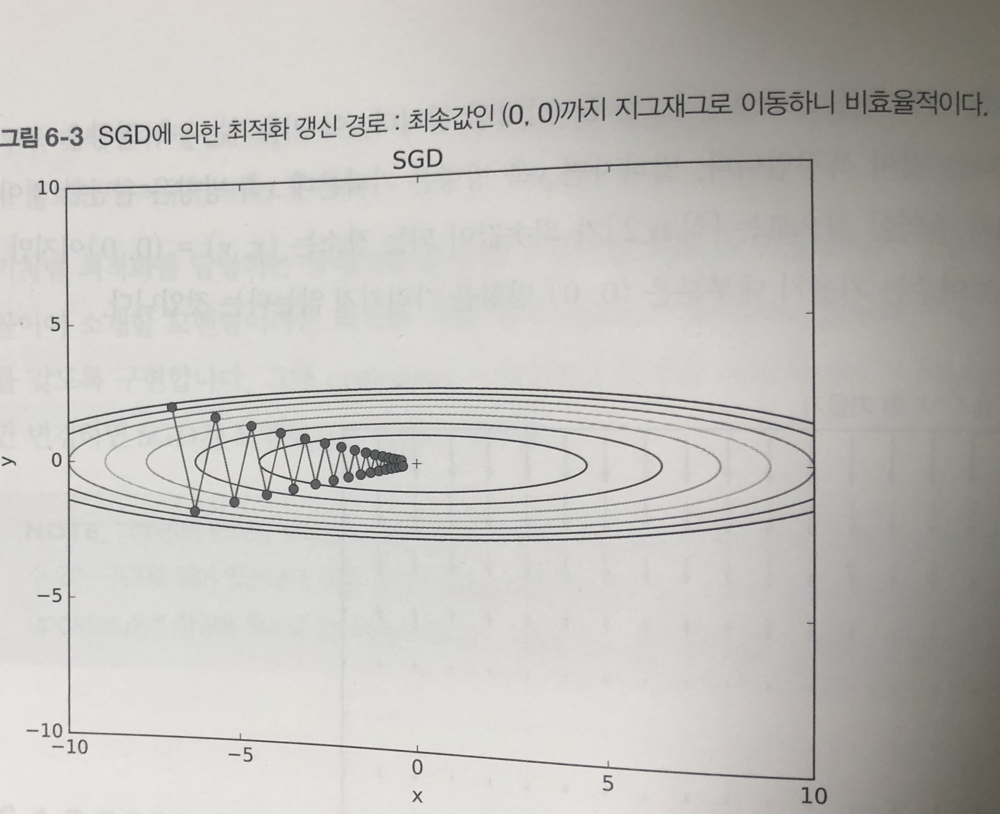
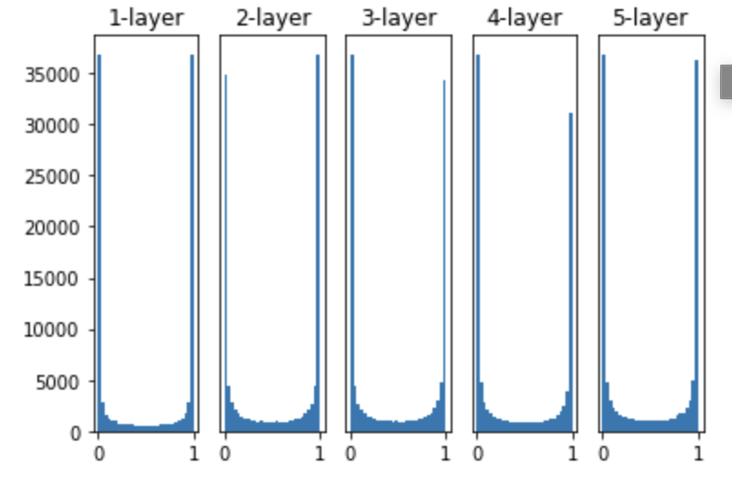
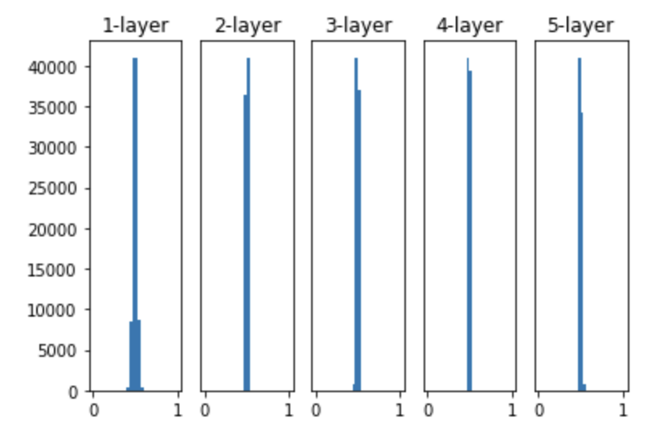
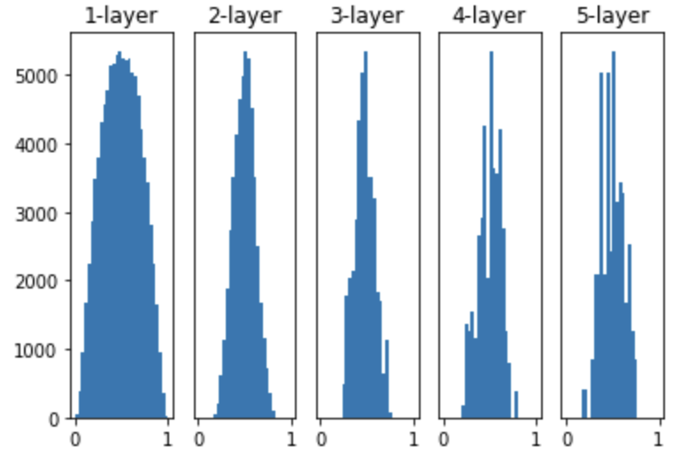
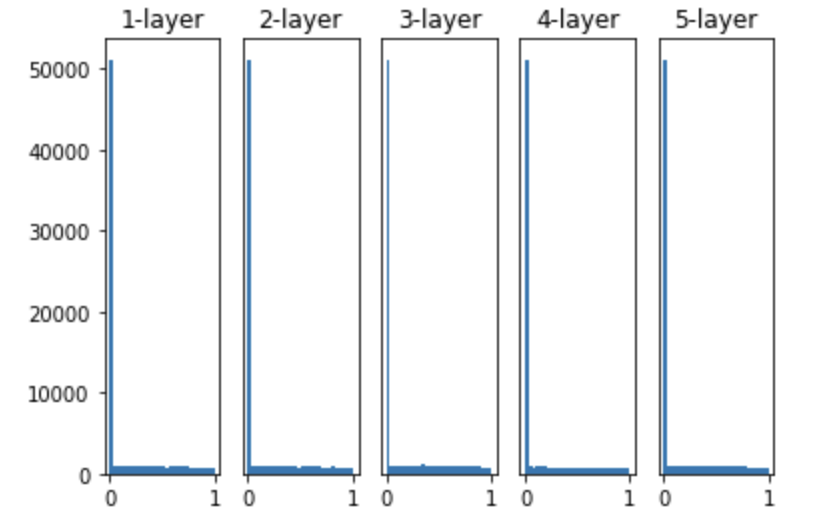
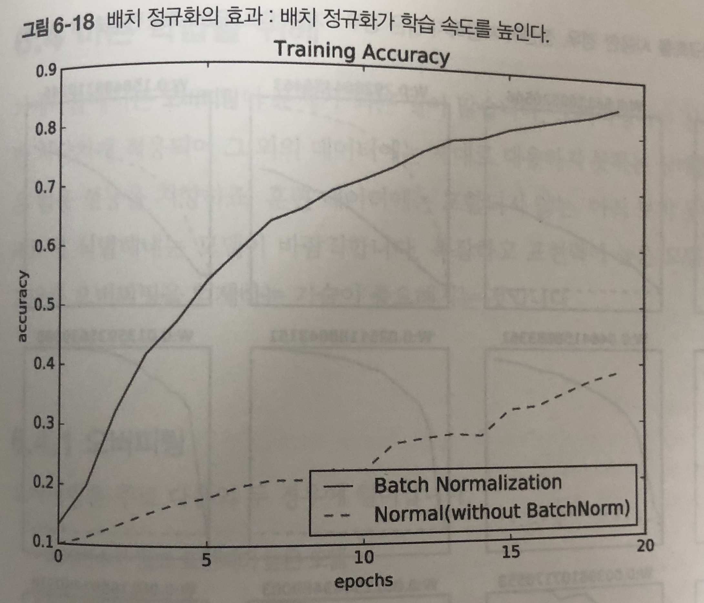
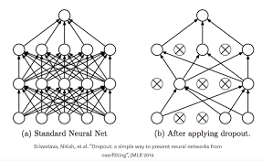

# Chapter 6. 학습 관련 기술들

- 신경망 학습의 핵심 개념들
  - 가중치 매개변수의 최적값을 탐색하는 최적화 방법
  - 가중치 매개변수 초깃값
  - 하이퍼파라미터 설정 방법
  - 오버피팅의 대응책인 가중치 감소와 드롭아웃 등의 정규화 방법
  - 배치 정규화

## 6.1 매개변수 갱신

- 신경망 학습의 목적: 손실 함수의 값을 가능한 낮추는 매개변수를 찾는 것 == 매개변수의 최적값을 찾는 것 == 최적화 문제
- 이전 챕터에서는 미분을 사용해서 매개변수의 기울기를 구해서 기울어진 방향으로 매개변수 값을 갱신하는 일을 반복 했었음
  - 이를 확률적 경사 하강법 (Statistical Gradient Decent, SGD)
  - 경우에 따라서는 비효율적일 수도 있음

### 6.1.1 모험가 이야기

- 만약 어떤 모험가가 산의 가장 깊은 곳을 탐색하려고 한다고 하자
- 이 때 눈 가리개를 쓰고 지도 없이 찾는 다고 하면 어떻게 효율적으로 걸음을 옮겨야 가장 효율적으로 찾을 수 있을까?
- 이 어려운 상황에서 중요한 단서는 땅의 '기울기'
  - 지금 서 있는 장소에서 가장 크게 기울어진 방향으로 가자는 것 == SGD

### 6.1.2 확률적 경사 하강법 (SGD)

- 확률적 경사 하강법은 일정 학습률을 정해서 값을 손실함수의 값이 적어지는 쪽으로 지속적으로 갱신한다.

```python
class SGD:
  def __init__(self, lr = 0.01):
    self.lr = lr
    
  def update(self, params, grads):
    for key in params.keys():
      params[key] -= self.lr * grads[key]
```

- 초기화 때에 전달한 학습률을 반복해서 업데이트를 수행한다.
- 위처럼 최적화를 담당하는 모듈을 분리해놓으면, 기능을 모듈화하기 쉽다.

### 6.1.3 SGD의 단점

- 구현이 간단하지만, 문제에 따라서는 비효율적일 때도 있다.
- 예를 들어 $$f(x,y) = {1 \over 20}x^2+y^2 $$ 의 최솟값을 구하는 문제를 생각해보자
- 이 함수는 밥그릇을 x축 방향으로 늘인듯한 모습을 하고 있다.
- 이 함수의 기울기를 생각해보면, y축 방향으로 크고, x축 방향으로는 완만한 것이 특징이다.
- 최솟값은 (0,0) 이지만, 대부분의 기울기가 최솟값을 가리키지 않는다는 점이다.
- 이와 같은 수식에 SGD를 적용하면 



- 위와 같이 지그재그로 비효율적으로 움직이게 된다.
- 이러한 단점을 개선해주는 모멘텀, AdaGrad, Adam 등의 방법이 존재한다.

### 6.1.4 모멘텀

- 모멘텀은 수식으로 다음과 같이 작성할 수 있다.
  - $$ v \leftarrow \alpha v - \eta { \partial L  \over { \partial W}}, W \leftarrow W + v$$
  - W는 가중치 매개변수, $$\eta { \partial L  \over { \partial W}}$$ 는 손실함수의 기울기 $$\eta$$는 학습률이다. v라는 새로운 변수가 나오는데, 물리에서 말하는 속도에 해당한다.
  - $$\alpha v$$ 항은 초기 값으로 서서히 하강 시키는 역할을 한다.

```python
class Momentum:
  def __init__(self, lr = 0.01, momentum = 0.9):
    self.lr = lr
    self.momentum = momentum
    self.v = None
    
  def update(self, params, grads):
    if self.v is None:
      self.v = {}
      for key, val in params.items():
        self.v[key] = np.zeros_like(val)
        
    for key in params.keys():
      self.v[key] = self.momentum * self.v[key] - self.lr * grads[key]
      params[key] += self.v[key]
```

### 6.1.5 AdaGrad

- 신경망 학습에서는 학습률이 중요하다. 너무 작으면 학습 시간이 너무 길어지고, 너무 크면 제대로 이루어지지 않는다.
- 학습률을 정하는 효과적인 기술로 학습률 감소 (learning rate decay)가 있음
  - 학습을 진행하면서 점차 학습률을 줄여가는 방식
- 학습률을 서서히 낮추는 가장 간단한 방법은 매개변수 '전체'의 학습률 값을 일괄적으로 낮추는 것
- 이를 더 발전시켜서 매개변수 각각에 맞춤형 값을 만들어 감소시키는 방법을 택함

```python
class AdaGrad:
	def __init__(self, lr = 0.01):
    self.lr = lr
    self.h = None
    
  def update(self, params, grads):
    if self.h is None:
      self.h = {}
      for key in params.items():
        self.h[key] = np.zeros_like(val)
    
    for key in params.keys():
      self.h[key] += grads[key] * grads[key]
      params[key] -= self.lr * grads[key] / np.sqrt(self.h[key] + 1e-7)
```

- 가중치 값을 개별 매개변수에 적응적으로 학습률을 조정하면서 학습을 진행
- h는 기존 기울기 값을 제곱하여 계속 더해주고, 매개변수를 갱신할 때 $$ {1 \over {\sqrt{h}}}$$ 를 곱해서 학습률을 조정
  - 많이 움직인 원소는 학습률이 낮아진다

### 6.1.6 Adam

- 모멘텀과 AdaGrad를 융합하여 적용하면 어떻게 될까에서 시작한 기법
- 위 두가지 기법을 합치게 되면, 매개변수 공간을 효율적으로 탐색해 줄것을 기대함과 동시에 하이퍼 파라미터에 대한 편향 보정이 진행된다는 이점을 누릴 수 있다.
- https://github.com/oreilly-japan/deep-learning-from-scratch/blob/master/common/optimizer.py#L98-L130

### 6.1.7 어느 갱신 방법을 이용할 것인가?

- 어느 방법이 가장 효과적인가?
  - 풀어야 할 문제가 무엇이냐에 따라 달라지므로 주의해야한다.
  - 또한 학습률 등의 하이퍼 파라미터를 어떻게 설정하느냐에 따라서도 결과가 바뀐다.
- 모든 문제에 뛰어난 기법은 없으며 문제에 따라서 적용해야 한다.
- 지금도 많은 연구에서 SGD를 사용함
- 모멘텀과 AdaGrad도 충분히 사용해볼만 함
- 요즘은 Adam을 많이 사용하는 추세

## 6.2 가중치의 초깃값

- 초깃값을 무엇으로 설정하느냐가 신경망 학습의 성패를 가르는 일이 자주 있음
- 권장 초깃값에 대하여 설명하고 어떻게 이루어지는지 확인해보자

### 6.2.1 초깃값을 0으로 하면?

- 오버피팅을 억제해 범용 성능을 높이는 가중치 감소 (weight decay) 기법이 존재
  - 가중치 매개변수의 값이 작아지도록 학습하는 방법
- 가중치 값을 작게 만들고 싶으면 초깃값도 작은 값에서 시작하는 것이 가장 기본
- 이전까지는 초깃값을 정규분포에서 생성되는 값을 0.01 배 한 값 (0.01 * np.random.randn(10, 100))으로 사용했었음
- 가중치 값을 0으로 하면 어떻게 될까?
  - 학습이 올바로 이루어지지 않음
  - 오차역전파법에서 모든 가중치의 값이 똑같이 갱신되기 때문
- 예를 들어, 2층 신경망에서 두번째 층의 가중치가 0이라면, 순전파 때는 입력층 가중치가 0이기에 모든 값이 그대로 다음층으로 전달된다. (모두 똑같이 갱신 된다는 말이 됨)
- 이를 방지 하기 위해서는 가중치를 랜덤한 값으로 설정해야한다

### 6.2.2 은닉층의 활성화값 분포

- 은닉층의 활성화값의 분포를 관찰하면 중요한 정보를 얻을 수 있다.

- 시그모이드의 활성화 값 분포를 히스토그램으로 돌려보자

  - https://github.com/oreilly-japan/deep-learning-from-scratch/blob/master/ch06/weight_init_activation_histogram.py
  - 층이 5개가 있으며 각 층의 뉴렁느 100개씩 사용, 입력 데이터로 1000개를 정규분포로 무작위 생성하여 신경망에 흘림
  - 가중치의 분포는 표준편차가 1인 정규분포를 사용, 표준편차를 바꿔가면서 활성화 값들의 분포가 어떻게 바뀌는지 확인

- 

  - 각층의 활성화 값들이 0과 1에 치우쳐 분포됨을 알 수 있음
    - 출력이 0에 가까워지면 미분은 0에 다가감, 그래서 데이터가 0과 1에 치우쳐 분포하게 되면 역전파의 기울기 값이 점점 작아지다가 사라지게 됨
    - 이러한 현상을 기울기 소실 (gradient vanishing)이라 함
  - 가중치의 표준 편차를 0.01로 바꾸어 실험해보자
  - 
    - 이번에는 0.5 부근에 집중 되었음
    - 활성화 값이 치우친 것은 표현력 관점에서 좋지 않다는 것 (다수의 뉴런이 거의 같은 값을 출력한다.)
  - 딥러닝에서 표준적으로 사용하는 다른 초깃값인 Xavier 초깃값을 써보자
    - 각 층의 활성화값을 광범위하게 분포시킬 목적으로 가중치의 적절한 분포를 찾고자 하였음 이에 $$ 1 \over \sqrt{n} $$ 인 분포를 사용하면 된다는 결론을 만들어 냄
  - 
    - 층이 깊어지면서 형태가 다소 일그러지지만, 확실히 넓게 분포됨
    - 오른쪽으로 갈수록 일그러지는 분포는 탄젠트 함수를 활성화 함수로 사용하면 더 나은 효과를 얻게 됨

  ### 6.2.3 ReLU를 사용할 때의 가중치 초깃값

  - Xavier 초깃값은 활성화 함수가 선형일 때의 전제로 만들어낸 값
  - 반면 ReLU는 특화된 초깃값을 사용하는것을 권장함
    - 이 값을 He 초깃값이라고 한다.
  - 앞계층의 노드가 n개 일때, 표준편차가 $$ \sqrt{2 \over n} $$ 인 정규분포를 사용하는 것이 좋다.
  - 
    - He 초깃값은 모든 층에서 균일하게 분포됨

### 6.2.4 MNIST 데이터셋으로 본 가중치 초깃값 비교

- 표준편차가 0.01인 경우, Xavier 초깃값, He 초깃값을 사용한 경우를 비교해보자
- 표준편차가 0.01 인경우와 다르게 Xavier와 He는 빠르게 손실함수를 최소화 하는 방향으로 값이 바뀌어 가는 것을 확인할 수 있다.

## 6.3 배치 정규화

- 각층이 활성화를 적당히 퍼뜨리도록 강제해보면 어떻게 되는가?
  - 배치 정규화 (Batch Normalization)이 그런 아이디어에서 출발함

### 6.3.1 배치 정규화 알고리즘

- 2015년에 제안된 방법임에도 많은 연구자들이 즐겨쓰는 방법
  - 빨리 학습을 할 수 있다.
  - 초깃값에 크게 의존하지 않는다
  - 오버피팅을 억제한다.
- 기본 아이디어는 각 층에서의 활성화 값이 적당히 분포되도록 조정하는 것
  - 데이터 분포를 정규화하는 배치 정규화 계층 Batch Norm 계층을 신경망에 삽입한다.
- 배치 정규화는 그 이름과 같이 미니배치를 단위로 정규화를 한다.
  - 구체적으로 데이터 분포가 평균이 0, 분산이 1인 표준 정규분포를 갖도록 정규화를 수행한다.
- 이 처리를 활성화 함수의 앞 혹은 뒤에 삽입함으로써 데이터 분포가 덜 치우치게 할 수 있다.
  - 이 때, 적절히 정규화된 입력에 대하여 확대와 이동을 수행한다.
  - $$ y_i \leftarrow \gamma \hat{x}_i + \beta $$
  - gamma 값은 1, beta 값은 0부터 시작하고, 학습하면서 적합한 값으로 조정한다.
- 이 알고리즘이 순전파 때 사용

### 6.3.2 배치 정규화의 효과

- MNIST 데이터 셋을 사용하여 배치 정규화 계층을 사용할 때와 그렇지 않을 때의 학습 진도가 어떻게 달라지는지 확인해보자.
- 
- 배치 정ㄷ규화를 사용하여 학습의 정확도를 빠르게 높일 수 있다.

## 6.4 바른 학습을 위해

- 기계학습에서는 오버피팅이 문제가 되는 일이 많다.
  - 훈련 데이터에 신경망이 지나치게 적응하여 그 외에 데이터에는 적절히 대응하지 못하는 상태
  - 범용적이지 못함

### 6.4.1 오버피팅

- 주로 다음 두 가지 경우에 일어난다
  - 매개변수가 많고 표현력이 높은 모델
  - 훈련 데이터가 적은 경우
- MNIST 데이터에서도 훈련 데이터의 수를 이전보다 적게 설정하고, 은닉층의 갯수를 늘리게 되면, 훈련 데이터에 대하여는 높은 정확도를 가지지만, 실험 데이터에는 그렇지 못하게 된다.

### 6.4.2 가중치 감소

- 오버피팅 억제용으로 예로부터 만힝 사용한 방법은 가중치 감소 (weight decay)가 있다.
- 학습 과정에서 큰 가중치에 대해서는 그에 상응하는 큰 페널티를 부과하여 오버피팅을 억제하는 방법
- 가중치 감소는 모든 가중치 각각의 손실함수에 $$ {1 \over 2} \lambda W^2$$ 를 더한 값이다. 
  - $$\lambda$$는 정규화의 세기를 조절하는 파라미터이며, W는 가중치이다.
  - 가중치의 제곱 노름인 L2 노름을 손실함수에 더한 것이다.

### 6.4.3 드롭아웃

- 오버피팅을 억제하는 방법으로 손실함수에 가중치의 L2 노름을 더한 가중치 감소 방법이 있엇다.
- 가중치 감소는 간단하게 구현하고 어느정도 지나친 학습을 억제할 수 있다.
- 하지만 신경망이 복잡해지만 단순 감소만으로는 대응이 어려워진다.
  - 이럴때는 흔히 드롭아웃 이라는 기법을 사용한다.
- 드롭아웃은 뉴런을 임의로 삭제하면서 학습하는 방법이다.
  - 훈련 때의 은닉층 뉴런을 무작위로 골라 삭제한다.
  - 삭제된 뉴런은 신호를 전달하지 않는다.
  - 시험 때에는 모든 뉴런의 신호를 전달하게 된다. (단, 각 뉴런 출력에 훈련 때 삭제한 비율을 곱하여 출력한다.)
- 

```python
class Dropout:
  def __init__(self, dropout_ratio = 0.5):
    self.drop_out_ratio = dropout_ratio
    self.mask = None
    
  def forward(self, x, train_flag = True):
    if train_flag:
      self.mask = np.random.rand(*x.shape) > self.drop_out_ratio
      return x * self.mask
    else:
      return x * (1.0 - self.drop_out_ratio)
    
  def backward(self, dout):
    return dout * self.mask
```

- 핵심은 훈련할 때 순전파 때마다 self.mask에 삭제할 뉴런을 False로 마스크에 표시한다는 것
  - 역전파의 ReLU와 동작이 같다.
- 신호를 순전파 때에 통과시켰다면, 역전파 때에도 동일하게 통과시킨다.
- 동일하게 MNIST 데이터에 적용해보면, 훈련 데이터에 대한 정확도는 떨어지지만, 실험 데이터와의 괴리가 줄어드는 것을 확인할 수 있다.

## 6.5 적절한 하이퍼파라미터 값 찾기

- 신경망에는 하이퍼파라미터가 다수 존재함
- 이 값들을 적절히 설정하지 않으면 모델의 성능이 떨어지기도 함

### 6.5.1 검증 데이터

- 지금까지는 데이터셋을 훈련, 시험 데이터로 분리해서 사용했다.
- 앞으로 하이퍼파라미터의 성능을 비교하는 것을 시도할 텐데, 그 때에는 훈련, 실험 데이터만으로는 부족하게 됨
  - 시험데이터를 사용하여 하이퍼파라미터를 조정하면 파라미터 값이 오버피팅 될 우려가 있음
  - 시험데이터에만 좋도록 피팅이 될 수 있음
- 그래서 하이퍼 파라미터를 조정할 때에는 전용 확인 데이터가 필요하게 되며, 이를 검증 데이터라고 함
- 검증데이터를 얻는 간단한 방법은 20% 정도를 검증 데이터로 먼저 분리하는 것

```python
(x_train, t_train), (x_test, t_test) = load_mnist()

x_train, t_train = shuffle_dataset(x_train, t_train)

validation_rate = 0.20
validation_num = int(x_train.shape[0] * validation_rate)

x_val = x_train[:validation_num]
t_val = t_train[:validation_num]
x_train = x_train[validation_num:]
t_train = t_train[validation_num:]
```

- 데이터를 뒤섞고 그에 대하여 데이터를 뽑아 낸다.

### 6.5.2 하이퍼파라미터 최적화

- 최적화의 핵심은 최적 값이 존재하는 범위를 조금씩 줄여간다는 것
- 우선 대략적인 범위를 정하고, 그 범위에서 무작위로 값을 골라낸 후, 그 값으로 정확도를 평가하는 것
  - 범위는 대략적으로 지정하는 것이 효과적 (10의 거듭 제곱 단위: 0.001 ~ 1000 사이)
- 최적화는 며칠이 걸린다는 점을 기억하자
  - 나쁠듯한 값은 미리 포기한다.
  - 학습을 위한 에폭을 작게하여 1회 평가에 걸리는 시간을 단축하는 것이 효과적
- 최적화의 단계는 다음과 같다.
  - 0단계: 값의 범위를 설정
  - 1단계: 설정된 범위에서 값을 무작위로 추출
  - 2단계: 1단계에서 샘플링한 값을 사용하여 학습하고 검증데치터로 정확도를 평가
  - 3단계: 1~2단계를 특정 횟수 반복하여, 정확도를 보고 범위를 좁혀간다.
- Example) https://github.com/oreilly-japan/deep-learning-from-scratch/blob/master/ch06/hyperparameter_optimization.py