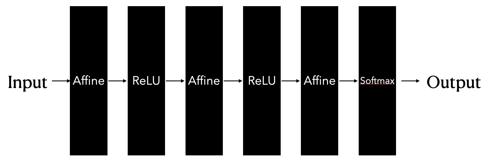
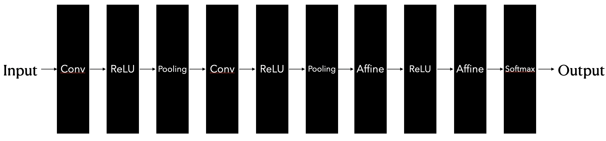
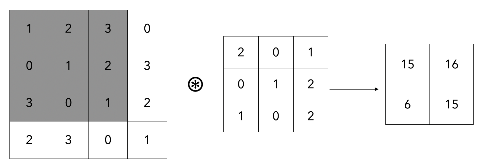
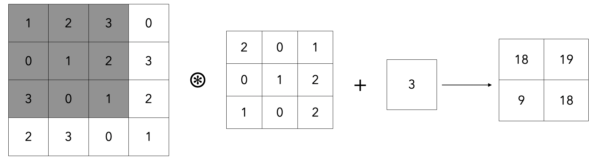
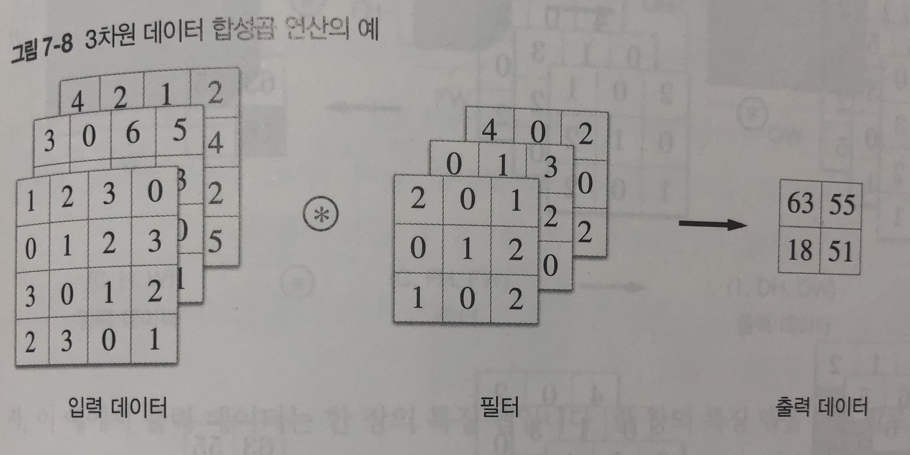
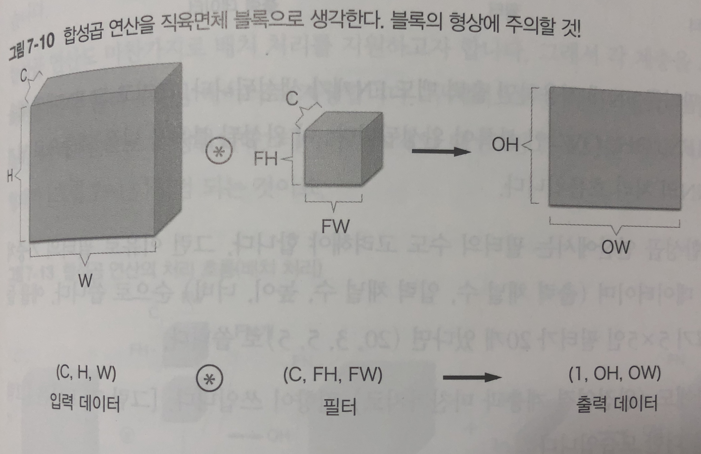
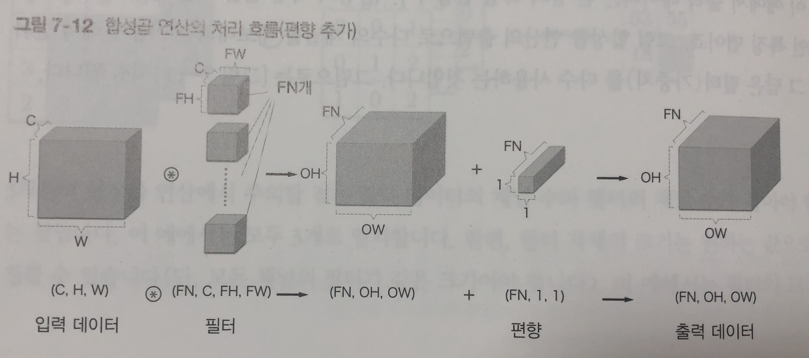
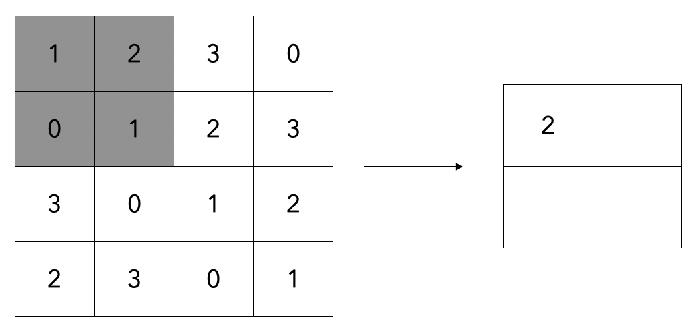
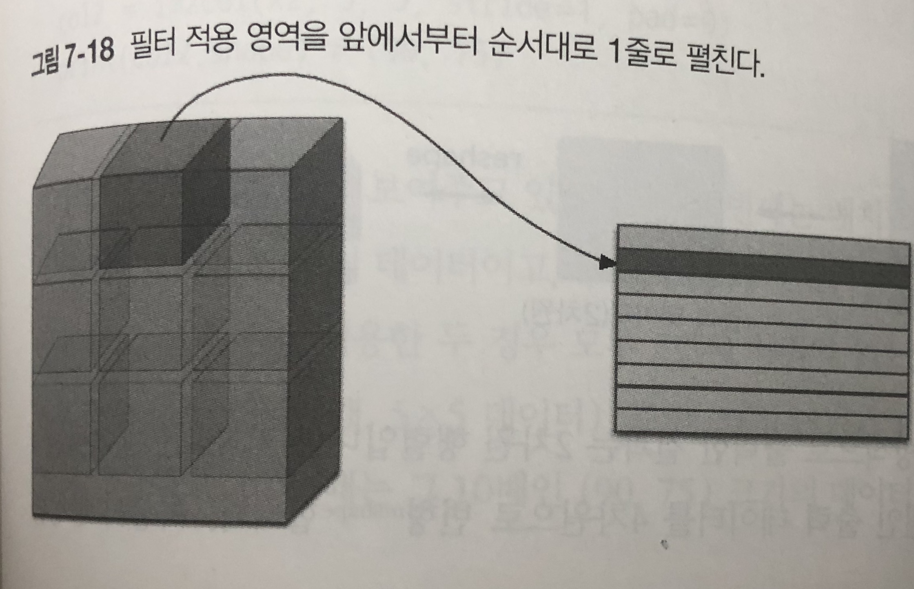
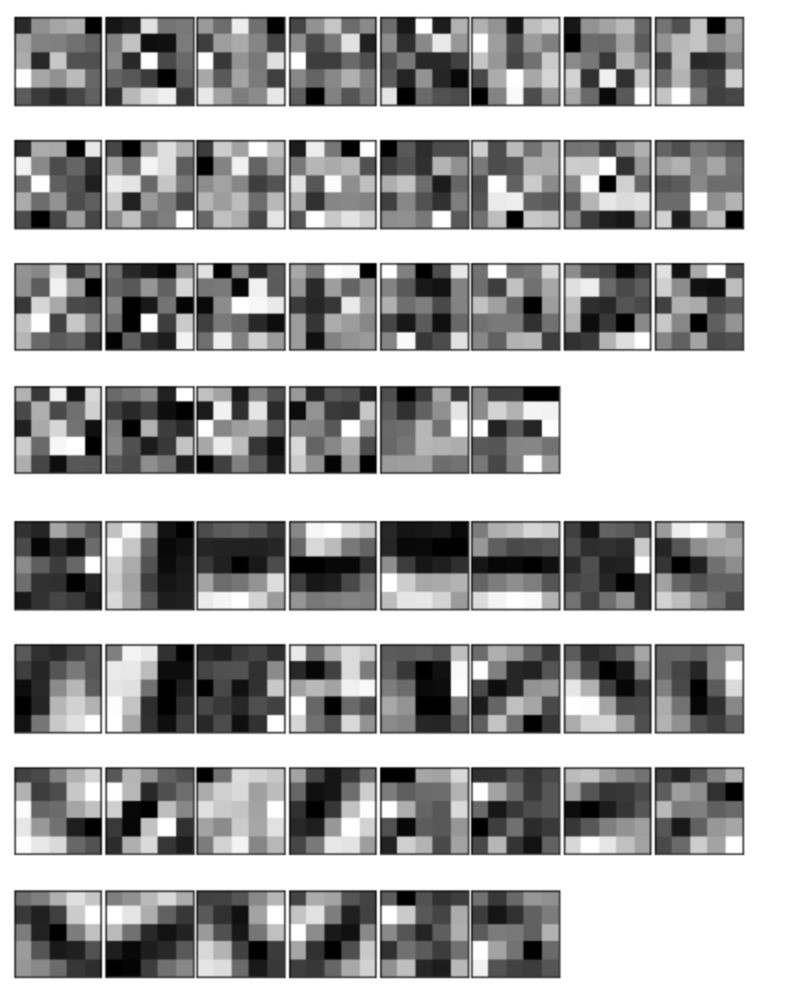

# Chapter 7. 합성곱 신경망(CNN)

- 합성곱 신경망 (Convolutional Neural Network, CNN)은 이미지 인식과 음성 인식등 다양한 곳에서 사용됨

## 7.1 전체 구조

- CNN도 지금까지 본 신경망과 같이 레고 블록처럼 계층을 조합하여 만들 수 있다.
  - 다만 합성곱 계층 (Convolutional Layer)와 풀링 계층 (Pooling Layer)가 새롭게 추가됨
- 이 계층들을 이용하여 어떻게 CNN을 만드는지 살펴보자
- 이전까지의 신경망은 인접한 계층의 모든 뉴런과 결합이 되어 있었음
  - 이를 완전 연결 (fully-connected, 전결합)이라고도 하며, 완전히 연결된 계층을 Affine 계층으로 구현했었음
- 
  - 그림처럼 Affine 계층과 ReLU 계층을 거쳐서 마지막에는 Softmax 함수를 사용해서 결과값을 얻어 (어떤 값일지 예측하는 확률을 얻었음)
- 그렇다면 CNN의 구조는 어떨까?
- 
  - 새로운 합성곱 계층과 풀링 계층이 추가된다.
  - CNN의 계층은 Conv-ReLU-(Pooling)의 흐름으로 연결된다 (풀링이 생략되기도 한다)
  - Affine-ReLU가 Conv-ReLU-(Pooling)으로 바뀌었다.
- 또 새로운 점은 기존의 Affine-ReLU 계층을 그대로 사용할 수 있고, 마지막에서는 Softmax 함수를 활용해서 결과값을 얻을 수도 있다는 것이다.

## 7.2 합성곱 계층

- CNN에서는 패딩 (padding), 스트라이드 (stride) 등의 용어가 등장한다.
- 계층 사이에서는 3차원 데이터와 같이 입체적인 데이터가 흐른다는 점에서 기존의 신경망과 다르다

### 7.2.1 완전연결 계층의 문제점

- 완전연결 계층의 문제점은 무엇일까?
  - 데이터의 형상이 무시된다는 사실
  - 입력 데이터가 이미지인 경우, 가로, 세로, 채널(색상)으로 구성된 3차원 정보이다.
  - 그러나 완전 연결 계층에 입력할 때에는 3차원 데이터를 1차원 데이터로 플랫하게 해주어야한다.
  - 지금까지 MNIST 데이터셋이 (1, 28, 28)인 이미지를 784개의 데이터로 1렬로 만들어서 입력을 넣었다.
  - 3차원 이미지 데이터는 인접한 픽셀의 위치 정보 등 3차원 속에서 의미를 갖는 본질적인 패턴이 존재할 수 있다.
- 합성곱 계층은 형상을 유지한다.
  - 데이터를 3차원으로 입력받아서 마찬가지로 다음 계층으로 3차원 데이터로 전달한다.
  - 데이터를 제대로 이해할 가능성이 있게 된다.
- 합성곱 계층의 입출력 데이터를 특징 맵 (feature map)이라고 한다. 입력을 입력 특징 맵, 출력을 출력 특징 맵이라고 하는 식이다.

### 7.2.2 합성곱 연산

- 합성곱 계층에서 합성곱연산을 처리한다.
  - 이미지 처리에서 말하는 필터연산에 해당



- 왼쪽 항을 입력 데이터, 합성곱으로 곱해지는 항을 필터라고 하며, 커널이라고도 칭하기도 한다.
- 합성곱 연산은 윈도우를 일정 간격으로 이동해 가며 입력 데이터를 적용한다.
- 그림에서 보듯 입력과 필터에서 대응하는 원소끼리 곱한 후 그 총합을 구한다.
  - e.g., 회색으로 칠해진 항 (1 * 2 + 2 * 0 + 3 * 1 + ... 0 * 0 + 1 * 2 = 15)
- 완전연결 신경망에서는 가중치 매개변수와 편향이 존재하는데, CNN에서는 필터의 매개변수가 가중치에 해당한다.
- 편향까지 더하면
  - 
  - 위와 같이 이루어지며, 편향은 항상 하나의 값 (1 X 1) 만 존재한다.

### 7.2.3 패딩

- 합성곱 연산을 수행하기 이전에 데이터 주변을 특정값으로 채우기도 한다.
- 이를 패딩이라고 함
- 예를 들어, 4X4 크기의 입력 데이터를 폭 1짜리 패딩을 하게 되면 가장 바깥으로 특정 값을 채워서 5X5의 입력 데이터를 만들수 있게 된다.
- 패딩은 주로 출력 크기를 조정할 목적으로 사용한다. 예를 들어, (4,4) 입력 데이터에 (3,3)의 필터 데이터를 합성곱 연산하면, 출력은 (2,2)가 되지만, 패딩을 한번 더 설정하면 (4,4)로 크기가 유지된다.
  - 연산을 수행하면 할 수록 크기가 줄어들 수 있기 때문에 패딩을 적절히 사용하여 입력 데이터의 공간적 크기를 고정한 채로 다음 계층으로 데이터를 전달할 수 있게 된다.

### 7.2.4 스트라이드

- 필터를 적용하는 위치의 간격을 스트라이드 (stride)라고한다.
- 위의 예제에서는 필터를 1칸씩 이동하여 연산을 수행하였는데, 이는 스트라이드 값이 1임을 의미한다.
- 스트라이드를 2로 하면 윈도우가 2칸씩 움직이게 된다.
- 스트라이드의 값을 늘리면 출력 크기가 줄어들고, 패딩의 값을 늘리면 출력 크기가 늘어나게 된다.
- 이를 수식으로 나타내보면
  - $$ OH =  {H + 2P - FH \over S} + 1 $$
  - $$ OW = {W + 2P - FW \over S} + 1$$
  - 입력 크기를 (H, W), 필터 크기를 (FH, FW), 출력 크기를 (OH, OW), 패딩을 P, 스트라이드를 S로 설정 하게 되면 위의 수식과 같이 출력의 크기가 결정이 된다.
  - 주의 사항은 위의 나눗셈이 정수로 나누어 떨어져야 한다는 점이다.

### 7.2.5 3차원 데이터의 합성곱 연산

- 이전까지 2차원 형상의 합성곱 연산을 살펴보았었다.
- 3차원은 그러면 어떻게 계산해야할까?
- 3차원 데이터는 입력 데이터와 필터의 합성곱 연산을 채널마다 수행하고 그 결과를 더해서 하나의 출력으로 얻을 수 있다.
- 
- 3차원 연산에서 주의할 점은 입력 데이터의 채널 수와 필터의 채널 수가같아야 한다는 점이다.
  - 필터 크기 자체는 원하는 값으로 설정할 수 있음 (단 모든 채널 필터의 크기가 같아야 한다.)

### 7.2.6 블록으로 생각하기

- 3차원의 연산은 데이터와 필터를 직육면체 블록이라고 생각하면 쉽다.
- 3차원 데이터는 (채널, 높이, 너비) 순서로 써보자
- 
- 이 예제에서의 출력데이터는 한장의 맵이 된다.
- 다수의 채널을 내보내려면 어떻게 해야할까?
  - 필터(가중치)를 다수 사용하는 것이다.
- 
  - 필터 FN개를 적용하면 출력 맵도 FN개가 생성된다.
  - 그에 맞추어서 편향의 갯수도 FN개 만큼 늘려주어야 한다.
  - 형상이 다른 블록의 덧셈은 넘파이의 브로드캐스트 기능으로 쉽게 구현할 수 있다.

### 7.2.7 배치 처리

- 각 계층을 흐르는 데이터의 차원을 하나 늘려서 4차원 데이터로 저장한다.
  - 데이터를 (데이터수, 채널수, 높이, 너비) 순으로 저장한다.
- 즉, 데이터 N개에 대하여
  - N 개의 데이터 (N, C, H, W) $$ \circledast $$ 필터 (FN, C, FH, FW) -> N개의 데이터 (N, FN, OH, OW) + 편향 (FN, 1, 1) -> N개의 출력 데이터 (N, FN, OH, OW)

## 7.3 풀링 계층

- 풀링은 세로 가로 방향의 공간을 줄이는 연산이다.
- 
  - 위와 같이 2 X 2 최대 풀링을 스트라이드 2로 처리하는 순서이다. 최대 풀링은 최댓값을 구하는 연산으로 2 X 2는 대상 영역의 크기를 뜻한다.
  - 즉, 2X2 영역에서 가장 큰 값을 꺼내오는 작업을 수행한다.
- 최대 풀링 외에도 평균 값을 가져오는 평균 풀링 기법도 존재한다.

### 7.3.1 풀링 계층의 특징

- 학습해야 할 매개변수가 없다.
  - 풀링은 대상 영역에서 최댓값이나 평균을 취하는 명확한 처리이다.
- 채널 수가 변하지 않는다.
  - 입력 데이터의 채널 수 그대로 출력 데이터로 내보낸다.
- 입력의 변화에 영향을 적게 받는다 (강건하다)
  - 입력 데이터가 조금 변해도 풀링의 결과는 거의 변하지 않는다

## 7.4 합성곱/풀링 계층 구현하기

- 합성곱 계층과 풀링 계층은 복잡해 보이지만 트릭을 사용하면 쉽게 구현할 수있다.

### 7.4.1 4차원 배열

- 예를 들어 데이터의 형상이 (10, 1, 28, 28)이라면 높이 28, 너비 28, 채널 1개인 데이터가 10개이다.

```python
>>> x = np.random.rand(10, 1, 28, 28)
>>> x.shape
(10, 1, 28, 28)

>>> x[0].shape # (1, 28, 28), accessing first data
>>> x[0, 0] ## x[0][0], accessing first channel data
```

### 7.4.2 im2col로 데이터 전개하기

- 합성곱 연산을 곧이곧대로 수행하려면 for문을 엄청 많이 사용해야 한다.
- for 구문을 사용하면 성능이 떨어진다는 단점도 있다. (numpy에서는 원소 접근 시에 for 문을 사용하지 않는 것이 바람직하다)
- 이번 절에서는 im2col이라는 편의 함수를 사용해보자
  - 입력 데이터를 필터링(가중치 계산)하기 좋게 전개하는 함수이다.
- 
  - 위의 그림과 같이 필터를 적용하는 영역 단위로 한줄로 늘어놓는다.
- 필터 영역이 겹치게 되면 im2col로 전개한 이후에 원소의 수가 원래 블록의 수보다 많아지게 된다.
  - 그래서 메모리를 더 소비하는 단점이 있다.
- im2col로 입력 데이터를 전개한 다음에는 합성곱 계층의 필터를 1열로 전개하고 두 행렬의 곱을 개산하면 된다.
- 계산이 끝난 이후에는 다시 4차원 데이터로 변형하면 된다.

### 7.4.3 합성곱 계층 구현하기

- 이 책에서는 im2col 함수를 미리 구현하여 제공한다.
  - https://github.com/oreilly-japan/deep-learning-from-scratch/blob/master/common/util.py#L39-L68

```python
import sys, os
sys.path.append(os.pardir)

from common.util import im2col

x1 = np.random.rand(1, 3, 7, 7)
col1 = im2col(x1, 5, 5, stride = 1, pad = 0)
print(col1.shape) # (9, 75)
```

- 배치 크기가 1, 채널은 3개, 높이 너비가 7 X 7인 데이터에 대하여 적용하였다. 
- 이제 합성곱 계층을 구현해보자

```python
class Convolution:
  def __init__(self, W, b, stride = 1, pad = 0):
    self.W = W
    self.b = b
    self.stride = stride
    self.pad = pad
    
  def forward(self, x):
    FN, C, FH, FW = self.W.shape
    N, C, H, W = x.shape
    out_h = int(1 + (H + 2 * self.pad - FH) / self.stride)
    out_w = int(1 + (W + 2 * self.pad - FW) / self.stride)
    
    col = im2col(x, FH, FW, self.stride, self.pad)
    col_W = self.W.reshape(FN, -1).T
    out = np.dot(col, col_W) + self.b
    
    out = out.reshape(N, out_h, out_w, -1).transpose(0, 3, 1, 2)
    
    return out
```

- 입력 데이터를 im2col로 전개하고 필터도 reshape을 사용해서 2차원 배열로 전개했다. 그리고 이 두개의 행렬의 곱을 구한다.
- reshpae의 인수를 -1로 지정하였는데, 다차원 배열의 원소 수가 변환 후에도 똑같이 유지되도록 적절히 묶어준다.
- forward 메소드의 마지막에는 출력 데이터를 적절한 형상으로 바꿔준다.
  - 이 때 numpy의 transpose를 사용하여 순서를 바꿔준다.
- 역전파에서는 im2col을 역으로 처리해야한다. 이 책이 제공하는 col2im 메소드를 사용하여 반대로 수행한다.
  - https://github.com/oreilly-japan/deep-learning-from-scratch/blob/master/common/util.py#L71-L99
- 전체 합성곱 계층의 구현은 https://github.com/oreilly-japan/deep-learning-from-scratch/blob/master/common/layers.py#L198-L243 에 구현되어 있다.

### 7.4.4 풀링 계층 구현하기

- 합성곱 계층과 마찬가지로 im2col을 사용해서 입력 데이터를 전개한다.
- 단, 풀링의 경우에는 채널 쪽이 독립적이라는 점이 합성곱 계층 때와 다르다.
  - 채널별로 전개한 다음에 해당 행에서 최댓값, 혹은 평균값만을 골라내면 된다.

```python
class Pooling:
  def __init__(self, pool_h, pool_w, stride = 1, pad = 0):
    self.pool_h = pool_h
    self.pool_w = pool_w,
    self.stride = stride
    self.pad = pad
    
  def forward(self, x):
    N, C, H, W = x.shape
    out_h = int(1 + (H - self.pool_h) / self.stride)
    out_w = int(1 + (W - self.pool_w) / self.stride)
    
    col = im2col(x, self.pool_h, self.pool_w, self.stride, self.pad)
    col = col.reshape(-1, self.pool_h * self.pool_w)
    
    out = np.max(col, axis = 1)
    
    out = out.reshape(N, out_h, out_w, C).transpose(0, 3, 1, 2)
```

- 풀링 계층 구현은 3단계로 진행한다.
  - 입력 데이터를 전개
  - 행별 최댓값 구한다
  - 적절한 모양으로 다시 성형한다.
- 역전파 방향은 ReLU 계층의 max 역전파를 참고하자. 
  - 코드는 https://github.com/oreilly-japan/deep-learning-from-scratch/blob/master/common/layers.py#L246-L284

## 7.5 CNN 구현하기

- 합성곱 계층과 풀링 계층을 조합하여서 손글씨 숫자를 인식하는 CNN을 조립해보자
- CNN 네트워크는 간단하게 Convolution-ReLU-Pooling-Affine-ReLU-Affine-Softmax 순으로 흐르게 작성해보자.

```python
class SimpleConvNet:
  def __init__(self, input_dim=(1, 28,28), conv_param{'filter_num': 30, 'filter_size': 5,
                                                     'pad': 0, 'stride': 1},
              hidden_size = 100, output_size = 10, weight_init_std = 0.01):
    filter_num = conv_param['filter_num']
    filter_size = conv_param['filter_size']
    filter_pad = conv_param['filter_pad']
    filter_stride = conv_param['filter_stride']
    input_size = input_dim[1]
    conv_output_size = (input_size - filter_size + 2 * filter_pad) / filter_stride + 1
    pool_output_size = int(filter_num * (conv_output_size / 2) * (conv_output_size / 2))
    
    self.params = {}
    self.params['W1'] = weight_init_std * np.random.randn(filter_num, input_dim[0], filter_size, filter_size)
    self.params['b1'] = np.zeros(filter_num)
    self.params['W2'] = weight_init_std * np.random.randn(pool_output_size, hidden_size)
    self.params['b2'] = np.zeros(hidden_size)
    self.params['W3'] = weight_init_std * np.random.randn(hidden_size, output_size)
    self.params['b3'] = np.zeros(output_size)
    
    # CNN layer creation
    self.layers = OrderedDict()
    self.layers['Conv1'] = Convolution(self.params['W1'], self.params['b1'],
                                      conv_param['stride'], conv_param['pad'])
    self.layers['Relu1'] = Relu()
    self.layers['Pool1'] = Pooling(pool_h = 2, pool_w = 2, stride = 2)
    self.layers['Affine1'] = Affine(self.params['W2'], self.params['b2'])
    self.layers['Relu2'] = Relu()
    self.layers['Affine2'] = Affine(self.params['W3'], self.params['b3'])
    self.last_layer = SoftmaxWithLoss()
    
  def predict(self, x):
    for layer in self.layers.values():
      x = layer.forward(x)
    return x
  
  def loss(self, x, t):
    y = self.predict(x)
    return self.last_layer.forward(y, t)
  
  def gradient(self, x, t):
    self.loss(x, t)
    
    dout = 1
    dout = self.last_layer.backward(dout)
    
    layers = list(self.layers.values())
    layers.reverse()
    
    for layer in layers:
      dout = layer.backward(dout)
      
    grads = {}
    grads['W1'] = self.layers['Conv1'].dW
    grads['b1'] = self.layers['Conv1'].db
    grads['W2'] = self.layers['Affine1'].dW
    grads['b2'] = self.layers['Affine1'].db
    grads['W3'] = self.layers['Affine2'].dW
    grads['b3'] = self.layers['Affine2'].db
    
    return grads
```

- 해당 네트워크로 데이터셋을 학습하면 훈련 데이터에 대한 정확도는 99.82%, 시험 데이터에 대한 정확도는 약 98.96 % 가 된다.

## 7.6 CNN 시각과 하기

- 합성곱 계층은 입력으로 받은 이미지 데이터에서 무엇을 보고 있을까?

### 7.6.1 1번째 층의 가중치 시각화하기

- https://github.com/oreilly-japan/deep-learning-from-scratch/blob/master/ch07/visualize_filter.py
- 

- 학습 전에 필터는 무작위로 초기화 되고 규칙성이 잘 안보인다.
- 학습을 마친 필터는 약간의 규칙성이 있는 이미지가 되었다.
  - 가로 엣지에 반응하는 필터, 세로 엣지에 반응하는 필터등이 생성된다.
- 이처럼 합성곱 계층의 필터는 엣지나 블롭 (덩어리) 등 원시적인 정보에 반응하는 필터가 된다. 이 정보가 뒷단 계층에 전달된다.

### 7.6.2 층 깊이에 따른 추출 정보 변화

- 1번째 층의 필터에서는 원시적인 엣지, 블롭 등의 저수준 정보가 추출된다
- 고수준으로 갈 수록 각 계층에 추출되는 정보가 더 추상화 된 이미지에 반응 하는 것을 알수 있다.

## 7.7 대표적인 CNN

### 7.7.1 LeNet

- 손글씨를 인식하는 네트워크
- 합성곱 계층과 풀링 계층을 반복하고 마지막에 완전 연결 계층을 거치면서 결과를 출력
- 활성화 계층으로 Sigmoid 사용

### 7.7.2 AlexNet

- 2012년에 발표된 네트워크로 딥러닝 열풍을 일으키는 것에 큰 역할을 함
- 합성곱 계층과 풀링 계층을 거듭하며 마지막에 완전연결계층을 거쳐 결과를 출력
- 활성화 함수로 ReLU 계층 사용
- LRN이라는 국소적 정규화를 실시하는 계층 ㄱ사용
- 드롭 아웃을 사용한다.