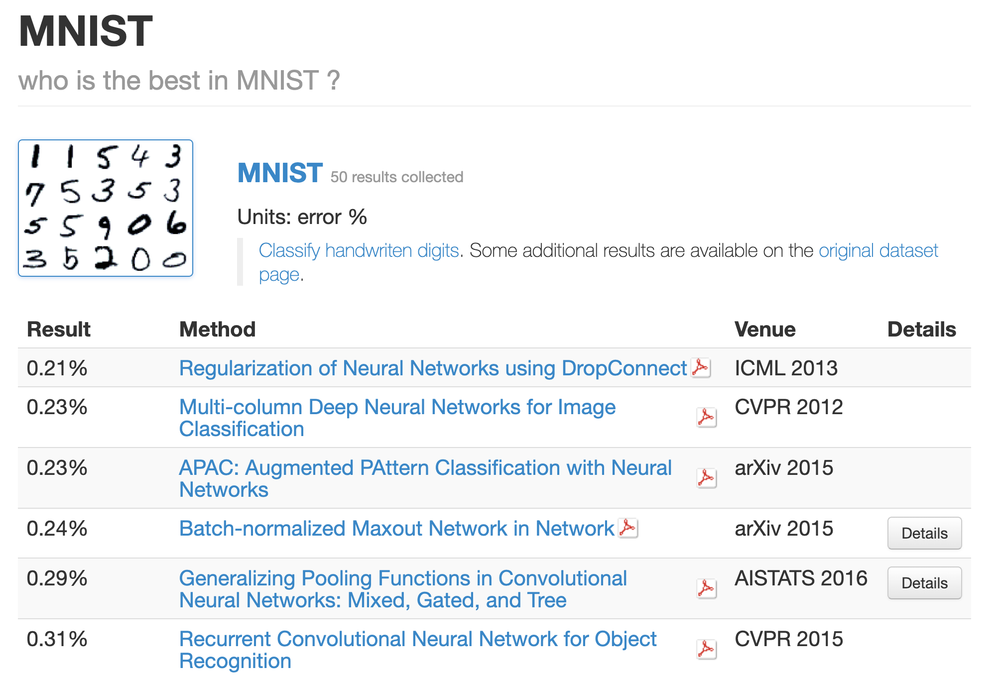
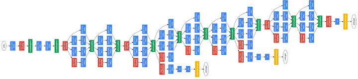

# Chapter 8. 딥러닝

- 딥러닝은 층을 깊게 한 심층 신경망이다.
- 이번 챕터에서는 딥러닝의 특징과 과제, 가능성을 살펴보자.

## 8.1 더 깊게

- 신경망을 구성하는 다양한 계층과 학습에 효과적인 기술, 영상 분야에 특히 유효한 CNN과 매개변수 최적화 기법 등을 배웠음
- 모두가 딥러닝에서 중요한 기술
- 심층 신경망으로 MNIST 데이터셋의 손글씨 숫자 인식에 도전해보자

### 8.1.1 더 깊은 신경망으로

- 손글씨 숫자를 인식하는 심층 CNN을 구성한다.
- 구성은 Input -> Conv -> ReLU -> Conv -> ReLU -> Pool -> Conv -> ReLU -> Conv -> ReLU -> Pool -> Conv -> ReLU -> Conv -> ReLU -> Pool -> Affine -> ReLU -> Dropout -> Affine -> Dropout -> Softmax -> Output 으로 구성한다.
  - 사용하는 합성곱 계층은 모두 3 X 3의 작은 필터.
  - 층이 깊어질 수록 채널 수가 더 늘어난다
  - 풀링 계층을 추가하여 중간 데이터의 공간 크기를 점차 줄여간다.
  - 마지막 단의 Affine 레이어에서는 드롭아웃 Layer를 사용한다.
  - 초깃값으로는 'He의 초깃값'을 사용하고,  Adam을 사용하여 최적화 한다.
  - 구현한 소스는 https://github.com/oreilly-japan/deep-learning-from-scratch/blob/master/ch08/train_deepnet.py 에 있다. 근데 직접 학습하면 반나절 걸린다.
    - https://github.com/oreilly-japan/deep-learning-from-scratch/blob/master/ch08/deep_convnet_params.pkl 를 사용하여 직접 불러오자
- 정확도는 99.38%가 된다.
- 인식에 실패한 이미지는 
  - 
  - 로 왼쪽 위가 인식 숫자, 오른쪽 아래가 실제 값이다.
  - 사람이 보기에도 아리송 한 것들로 딥러닝 네트워크가 실제 사람에 준하는 실정확도를 갖추었다.

### 8.1.2 정확도를 더 높이려면?

- What is the class of this image? (https://rodrigob.github.io/are_we_there_yet/build/classification_datasets_results.html#4d4e495354) 를 방문해보면
  - 
  - 어떤 모델이 가장 정확도가 높은지 알 수 있다.
  - Neural Network이나 Deep, Convolutional 등의 심층 신경망 관련 키워드가 많이 등장한다.
  - 대부분 합성곱 계층 2개에 완전연결 계층 2개 정도인 신경망
- 상위 기법들을 참고하면 정확도를 더 높일 힌트나 기술을 알 수 있다.
- 데이터 확장 (data augmentation)은 입력 이미지를 알고리즘을 통해서 인위적으로 확장한다.
  - 회전에 의한 변형
  - 이동에 의한 변형
  - 데이터가 몇개 없을 때 효과적이며, 딥러닝의 인식 수준을 개선할 수 있다.

### 8.1.3 깊게 하는 이유

- 층을 깊게 하는 것이 왜 좋은가에 대한 타당한 원리는 아직 없다.
- (직관적이지만) 층을 깊게 하는 것에 대한 직관적인 실험 결과는 몇가지 존재한다.
- 대규모 이미지 인식 대회의 결과에서는 대부분 층이 깊은 딥러닝 기반 신경망이 높은 정확도를 갖는다.
- 층을 깊게 할 때에는 신경망의 매개변수가 줄어들어서 적은 매개변수로 같은 수준의 표현력을 달성할 수 있다.
  - 매개변수는 층을 반복할수록 적어지며, 개수의 차이는 층이 깊어질수록 커진다.
  - 층을 거듭하면서 ReLU 등의 활성화 함수를 합성곱 계층 사이에 끼움으로써 신경망의 표현력이 개선된다.
- 학습의 효율성도 층을 깊게 하는 것이 이점이다.
  - 데이터의 양을 줄여 학습을 고속으로 수행할 수 있다.
- 정보를 계층적으로 전달할 수 있다
  - 에지를 추출한 층의 다음 층은 에지 정보를 사용할 수 있고, 더 고도의 패턴을 효과적으로 학습할 수 있으리라 기대할 수 있다.

## 8.2 딥러닝의 초기 역사

- 2012년부터 딥러닝에 기초한 기법, AlexNet이 압도적인 성적으로 이미지 인식 기술 대회에서 우승하면서부터 주목이 받기 시작되었다.

### 8.2.1 이미지넷

- 이미지넷은 100만 장이 넘는 이미지를 담고 있는 데이터셋
- 이 거대한 데이터셋을 사용하여 ILSVRC는 이미지 인식 기술을 겨루는 대회를 개최한다.

### 8.2.2 VGG

- VGG는 합성곱 계층과 풀링 계층으로 구성되는 기본적인 CNN이다.
- 다만 비중 있는 층(합성곱 계층과 완전연결 계층)을 모두 16층으로 심화하였다.
- VGG에서 주목할 점은 3X3의 작은 필터를 사용한 합성곱 계층을 연속으로 거친다는 것이다.

### 8.2.3 GoogLeNet

- 
  - 그림에서 보듯이 세로방향 깊이뿐 아니라 가로방향도 깊다는 점이 특징이다.
- 가로 방향에는 '폭'이 있으며, 인셉션 구조라고 한다.
  - 크기가 다른 필터를 여러개 적용하여 그 결과를 결합한다.
  - 이 구조를 하나의 빌딩 블록으로 사용한다.

### 8.2.4 ResNet

- MS에서 개발한 CNN
- 딥러닝에서 층이 너무 깊으면 학습이 잘 되지 않고, 성능이 떨어지는 경우가 많았다.
- ResNet에서는 그런 문제를 해결하기 위해서 스킵 연결 (skip connection)을 도입하였다.
  - 층에 깊이에 비례해 성능을 향상시클 수 있게 한 핵심
  - 입력 데이터를 합성곱 계층을 건너뛰어 바로 출력에 더하는 구조
  - 예를 들어, 입력 x 를 연속한 두 합성곱 계층을 건너뛰어 바로 출력에 연결한다.
- 스킵 연결은 층이 깊어져도 학습을 효율적으로 할 수 있도록 해주는데, 역전파 때 스킵 연결이 신호 감쇠를 막아준다.
  - 앞층의 '의미 있는 기울기'를 그대로 전할 수 있다는 기대가 있다.

## 8.3 더 빠르게 (딥러닝 고속화)

- 빅데이터와 네트워크의 발전으로 딥러닝에서는 대량 연산을 수행해야한다.
- 과거 CPU가 주로 고속 연산을 수행했지만 이제 GPU를 사용해서 대량 연산을 고속으로 처리한다.

### 8.3.1 풀어야 할 숙제

- 딥러닝 처리 시간은 오랜시간을 합성곱 계층에서 소요한다.
- GPU에서는 전체의 95%, CPU에서는 전체의 89%를 사용한다.
  - 합성곱 계층의 연산을 어떻게 효율적으로 올릴 수 있을까가 딥러닝 네트워크의 핵심

### 8.3.2 GPU를 활용한 고속화

- GPU는 병렬 수치 연산을 고속으로 처맇라 수 있으니 압도적인 힘으로 연산에 사용한다.
- 합성곱 계층은 대량의 단일 곱셈-누산을 수행해야한다.
- 이러한 연산은 GPU의 특기

### 8.3.3 분산 학습

- GPU로 연산을 꽤 가속화 할 수 있지만, 며칠 혹은 몇주가 걸릴수도 있다.
- 그리고 딥러닝은 여러번의 시행착오를 동반한다. 실험을 수없이 반복해야하기 때문에 1회 학습에 걸리는 시간을 최대한 단축하고 싶다는 욕구가 필연적으로 생김
  - 분산확장의 시작
- 다수의 기기로 계산을 분산하여 결과를 얻는다.
  - 구글의 텐서플로
  - 마이크로소프트의 CNTK
- 단, 계산을 어떻게 분산시키느냐는 어려운 문제
  - 컴퓨터 사이의 통신과 데이터 동기화 등의 문제를 풀어야함

### 8.3.4 연산 정밀도와 비트 줄이기

- 메모리 용량과 버스 대역폭도 병목지점이 될 수 있음
- 부동소수점을 사용하는 실수 표현도 정밀도에 영향을 주기 때문에 비트 수를 늘리는 것이 정밀도에 좋지만, 데이터 이동에 대한 부담이 있어 적절한 트레이드 오프가 필요함
  - 그러나 딥러닝은 적은 부동소수점 비트만으로도 출력 결과가 달라지지 않는 견고성이 특징이기 때문에 16비트 반정밀도만 사용해도 학습에 문제가 없다고 알려져 있음

## 8.4 딥러닝의 활용

- 이미지 인식 외에도 많은 분야에 사용된다.

### 8.4.1 사물 검출

- 이미지 속에 담긴 사물의 위치와 종류를 알아내는 기술
- 사물 검출에서는 이미지 어딘가에 있을 사물의 위치까지 알아내야 하고, 어떤 것인지 알아내야 한다.
- R-CNN이 유명하다.
  - 입력 이미지 -> 후보 영역 추출 -> CNN 특징 계산 -> 영역 분류
  - 후보 영역을 사각형으로 단순 분류하거나 SVM을 사용하는 등의 처리 과정은 복잡하지만, 큰틀에서는 후보영역 추출과 CNN을 적용하는 두 부분으로 나뉨
  - 후보 영역 추출은 비전 분야에서 사용되는 뛰어난 기술을 사용한다. (R-CNN에서는 Selective Search 사용)

### 8.4.2 분할

- 분할은 이미지를 픽셀 수준에서 분류하는 문제
- 픽셀 단위로 객체마다 채색된 지도(supervised) 데이터를 사용해 학습한다. 이후 추론할 때 입력 이미지의 모든 픽셀을 분류한다.

### 8.4.3 사진 캡션 생성

- 컴퓨터 비전과 자연어를 융합하여 사용하는 기술
- NIC (Neural Image Caption) 모델이 대표적으로 사용된다.
  - 심층 CNN과 자연어를 다루는 순환 신경망 (RNN)으로 구성
  - CNN으로 사진의 특징을 추출하고 그 특징을 RNN으로 입력한다.
  - RNN은 CNN이 추출한 초깃값으로 해서 텍스트를 순환적으로 생성한다.

## 8.5 딥러닝의 미래

### 8.5.1 이미지 스타일 변환

- 딥러닝을 활용해 화가처럼 그림을 그리는 연구
- 콘텐츠 이미지와 스타일 이미지를 입력해서 둘을 조합해서 새로운 그림을 만든다.

### 8.5.2 이미지 생성

- 아무런 이미지 입력 없이도 새로운 이미지를 그려내는 연구
- 먼저 대량의 이미지를 사용하여 학습하긴 하지만, 이후 아무런 입력 없이 새로운 그림을 그려낸다.
- 이미지를 생성하는 과정을 모델화 해서, 모델을 대량의 이미지를 사용해 학습하고, 새로운 그림을 생성하는 것이다.
- 이미지를 생성하는 생성자와 생성한 이미지를 식별하는 식별자를 사용해서 둘을 겨루도록 학습 시켜서 서로 더 정교하게 생성, 식별하도록 만드는 것이다.
  - 이렇게 둘의 능력을 부지런히 갈고닦게 한다는 개념이  GAN (Generative Adversarial Network) 기술이라고 한다.

### 8.5.3 자율 주행

- 사람 대신 컴퓨터가 자동차를 주행하는 자율 주행 기술
- 주위 환경을 올바르게 인식하는 기술이 가장 중요
- 예를 들어, SegNet이라는 CNN 기반 신경망이 주변 환경을 정확하게 인식해 낸다.
  - 입력 이미지를 분할해서 판정

### 8.5.4 Deep Q-Network (강화 학습)

- 무언가를 배울 때 사람이 시행착오를 수행하며 배우듯, 컴퓨터도 시행착오 과정에서 스스로 학습하게 하려는 분야가 있음.
  - 이를 강화학습이라 함.
- 강화학습에서는 에이전트라는 것이 환경에 맞게 행동을 선택하고, 행동에 의해서 환경이 변하는 것이 기본적인 틀
  - 환경이 변화하면 에이전트는 보상을 얻고, 에이전트는 더 나은 보상을 받는 쪽으로 에이전트의 행동 지침을 바로 잡는 것
  - 보상은 항상 명확하지 않을 수 있다. (e.g., 슈퍼마리오 게임을 플레이하는 에이전트의 극대화할 보상은 무엇일까?)
- 딥러닝 학습 중에서는 DQN (Deep Q-Network)라는 방법이 존재
  - 입력으로 게임 영상 정보를 입력하고 학습하여 게임을 플레이하는 모델
