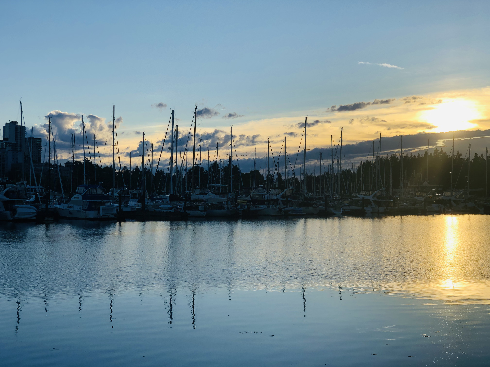

## 이 시기에 여기에 왔습니다.

정말 세상일은 알다가도 모르겠습니다. 많은 분들이 이 판대믹 상황에서 일자리를 잃는 분들도 계시고, (그래도 그나마 IT는 괜찮다고 하지만) 직장에서 위기감을 느끼시는 분들도 계시다고 알고 알고 있습니다. 그런데 저는 이곳에 와있습니다. 이곳이 어디냐구요? 대한민국의 (거의) 반대편 캐나다 밴쿠버입니다.

사실 오기까지는 많은 고민이 있었습니다. 어렵게 아내와 상의하고 가기로 결정하고 차분히 짐싸고, 친구들도 만나고 있었는데, 판대믹을 맞이하였습니다. 기존 계획은 4월 말에 이동 예정이었습니다. (그렇게 4월 말에 예정대로 라인에서 퇴사를 했죠) 그런데, 캐나다 하늘길이 막혀버렸습니다. 하염없이 기다리다가 마침내(?) 비자가 나와서 캐나다에 7월에 랜딩하였습니다.

작년에 면접을 볼때만 해도 정말 나는 영어가 그래도 조금은 통하는구나 하는 자신감이 있어서 (어디서 이런 못된것만 생겨가지고..) 랜딩을 하고 회사에서 마련해준 임시 숙소로 가는데, 세상에나 컨시어지, 매니저가 하는 말을 하나도 못알아먹겠는 겁니다. 그리고 저는 생각했죠. `아 이거 제대로 적응하기 어렵겠구나`

## 그리고 아직 적응 못했습니다.

아시겠지만, 이 시국에는 다른나라에서 건너왔다는 것은 처음에 2주간 격리 생활을 해야한다는 것을 의미합니다. 그리고 회사에서 3일만에 메일이 왔죠. 

`Hey Junho!, I hope you were settled in here safely. Let's start your first day at Amazon next week.`

음.. 뭐랄까. 이 사람이 왜 나한테 이러는 걸까. 하는 생각이 정말 들더군요. 뭐 어쩌겠습니까. 그 악명높은 회사에 제발로 걸어 들어왔으니.. 그렇게 그 다음주에 일을 시작하였습니다.

## 첫 날은 정신 없었죠

시중에 많이 나와 있는 Amazon 관련 도서를 보면 알겠지만, 아마존은 Self-service onboarding을 정말 중요하게 생각합니다. 물론 멘토가 있지만 (오 내 멘토 난 니가 있어서 정말 다행이야 ㅠㅠ), 대부분의 내용은 본인이 위키를 읽고, 관련 영상을 찾아보고, 습득한 다음에 일을 진행해야합니다. 더군다나 이 중차대한한(?) 시기에 회사를 들어오게 되었으니, 정말로 self-service를 해야했습니다. 첫날에 매니저와 간단하게 통화를 끝내고, 클라우드 환경을 받고(이틀 뒤에 노트북 받았습니다), 우당탕탕 팀원들과 인사를 한 뒤에 제 Day 1이 시작되었습니다.

비디오에 비디오에 비디오.. 그리고 쏟아지는 메일 (처음에 로그인하니 한 70통정도가 와있던 것으로 기억합니다..), 아 정말 정신없었습니다. 마음만큼 잘 안되었지만 어쨋든 저는 저 나름대로의 Day 1을 시작하였습니다.

## 이방인의 삶은 생각보다 넉넉하지 못합니다.

아무리 FAANG 기업 중 하나인 글로벌 자이언트 기업에 재직중이지만, 뭐 별 다르지 않습니다. 그냥 뭐 주어진 태스크 개발하고, 이야기 나누고, 조율하고, 개발자 일하는 것 다 똑같습니다. 다만, 주변 동료들이 다 영어를 쓰고, 몇몇은 첸하이의 알아먹기 힘든 영어를 쓰고, 놀면 뭐하니 지섭씨 처럼 `예?`를 한 서너번 정도 반복하고, 회의 끝난 다음에 회의 내용을 제 발로 정리해서 메일로 보낸다음 확인을 하는 과정이 추가되었을 뿐입니다. 게다가 일정도 약간 빡빡합니다. 다른 동료들은 그걸 잘 끝내고 잘은 모르겠지만 오프라인이 순식간에 되어버리더라구요.

어우 게다가 세금은 얼마나 때는지, 현실적으로 한국에서 어지간히 중간 이상 급여를 받으시는 분들은 여기에 가족과 함께 오신다면, (혼자 오는 것은 계산기를 두들겨 보니 풍족합디다. 물론 한국에서 혼자 벌어 혼자 먹고 사는 것도 풍족하져) 음.. 많은 고민을 해보시는 것도 좋을것 같습니다. 생각보다 급여가 많지 않거든요. 표면적인 액수는 많긴 하지만, 월세와 높은 물가를 감당하려다보니..

뭐 공기가 깨끗하다고 했는데, 최근에 [캘리포니아 산불](https://globalnews.ca/news/7349944/la-homes-california-wildfires/) 요 녀석 때문에 일주일은 창문도 못열고 있었죠.

가족도 보고 싶고 그렇죠. 킹시국이라 더 그런것 같습니다. 가고 싶을 때 가지 못하고, 항상 영상통화로 일주일에 짧게만 이야기하고 그러다보니 더 그런것 같습니다.

## 그럼에도 저는 여기서 더 버텨볼 생각입니다.

누구나 다 그렇겠지만, 이곳을 건너 올 때 생각으로는 10년은 버텨야겠다라는 생각으로 왔습니다. 우선 회사의 주식 베스팅이 4년이기도 하고, 그 정도 후에는 밴쿠버에 있는 나름 빅 컴퍼니는 다 다녀볼 생각입니다. 그리고 자녀 양육도 이곳이 복잡한 한국의 환경보다는 좋겠다라는 생각도 있고 말이죠. (아직 자녀가 없지만 이럴 때는 언제나 아버지의 마음이 되나 봅니다.) 그리고 코로나도 1~2년 내에 끝나지 않을까요? ㅎㅎㅎ 라는 희망적인 마음을 가져봅니다.

여기도 다 사람사는 동네이고 좋은 동료들도 많고, 모두가 친절하고 (뒤에서 칼들이 댈 때도 있지만), 환경이 여유롭고 가족을 많이 생각하게 되는 환경이니까요 :)

회사에 대한 내용을 더 많이 다루고 싶지만, 요새 사내의 Outside Activity를 심도있게 리뷰해보고 있습니다. ~~회사에서 짤리지 않기 위해~~ 나름 조심을 하면서 내용을 업데이트 해보도록 하겠습니다. 뭐 최근에 많이 출간되는 아마존 관련 책들이나 유튜브 내용이 다 비슷비슷하고, 뭐 그냥 다 비슷합니다. ㅎㅎ 그래도 WFH를 내년 까지 하게 될줄은 상상도 못했는데 말이죠.. WFH에서는 모든 것이 다 self service!!

하..
