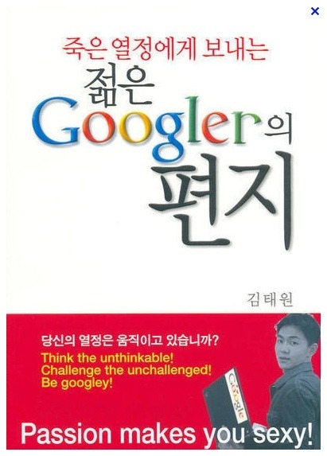

라떼는 말이야
-------

사실 이 말은 요새 연배가 있으신 분들이 이야기하는 내용인걸 다 아실겁니다. 라떼는 말이야 (나때는 말이야) 하면서 시작하는 그 시절 그 떄 그분들의 영웅적인 이야기 (?)

엄청난 서사들을 담고 있고 역경을 딛고 일어나서 지금의 부장님이 되셨다는 전설의 라떼 이야기

저는 오늘 그걸 하려는 건 아니구요 ㅋㅋ 그냥 제가 어떻게 이렇게 감사한 일들을 이루어 낼 수 있게 되었나 말씀드려볼까 합니다.

저는 어렸을적부터 게임을 좋아했고 자연스럽게 장래희망은 `프로게이머` 였습니다 (~~갑자기?~~)

그러다가 문득 이런 게임을 만드는 사람들은 어떤사람들일까? 하는 생각이 들었고 자연스레 저는 프로그래머로 왠지 모르겠지만 꿈을 정했습니다.

그리고 고등학교를 갈 때가 되어서 흔히 코딩을 배울 수 있는 `정보산업고등학교`에 갈 기회가 있었지만, 형이 다니던 `디자인 고등학교`가 너무 재미있어 보여서 거기로 옮기게 되었습니다. (사실 그것보다는 두발을 조금 더 자유롭게 기를 수 있다고 해서 그리로 갔습니다....) 그리고 열심히 기계설계를 배웠습니다.

고3이 되었고 관악 S대의 기계과에 지원했지만 귀신같이 탈락했고, 동작구의 S대에 붙게 되었습니다. ㅋㅋㅋㅋㅋㅋ (~~왜요 뭐요~~)

대학 다 떨어지고 진짜 컴공 하나만 붙었습니다. (기계과 대학은 다 떨어지고,, 항공대 가서 항공 정비를 배워보고 싶기도 했었는데, 예비 1..)

그렇게 다시 돌고 돌아 제 원래의 꿈으로 돌아왔습니다.

하지만 세상은 녹록지 않았죠
-------

대학교 1학년에 부푼 꿈을 안고 입학했것만 이건 내가 원하던 코딩이 아니었습니다.

화려한 코딩을 할 줄 알았지만 역시나 하는건 `Hello World` ㅋㅋㅋㅋ 

거기다가 3D업종으로 분류되어 정말 힘들거라는 예상이 많았습니다.

그러다가 그 분이 등장합니다.

그 분이 아이폰을 들고 나왔습니다.

뭔가 화려한 변화가 일어나기 시작했습니다.

하지만 여전히 제 안에는 아직 뭘 해야할지 모르는 갈팡질팡의 연속이었죠.

그리고 1학년 2학기에 저는 운명처럼 한 책을 만났습니다.
-------

그 당시에 도서관에서 근로 장학생으로 일하고 있었죠. (고등학교떄는 워낙 책을 안읽다가 대학생때는 뭔가 도서관에 끌려서.. ~~아싸라 그랬던거 아닙니다~~)

책정리를 하다가 이 책이 눈에 들어왔습니다. (책 제목 말고 `구글러`)

뭐 하는 사람일까 하고 읽었는데 그 자리에서 1시간 반정도만에 다 읽어버렸습니다.

말 그대로 딱 저에게 맞는 상황 (뭘 하긴 해야겠지만 뭘 해야할지 몰라서 의욕이 떨어져 있었고) + IT 선배 개발자의 조언이 필요한 시점이었습니다.

지금은 책의 내용이 자세히는 기억나지 않지만 (10년이 지나서.. 이제는 느낌만 남았..), 나보다 더 힘든 상황에 있는 분이 다방면의 노력과 말 그대로 20대 초반의 깡다구로 구글러가 되었고 못난 내가 할 수 있듯이 너희도 할 수 있다는 내용으로 기억합니다. (죄송합니다 한번 더 읽겠습니다 흑.)

그 이후로 제 삶은 바뀌었습니다.
-----

누구나 이런 기회가 온다고 하는데, 저에게는 그 것이 시작점이었습니다. 기름만 잔뜩 부어놓고 불지를줄 모르던 저에게 불지르는 방법을 알게 되었고 이렇게 불 질러서 성적은 최상위권, 4년 외부 장학재단 장학생 + BoB 멤버십 + 소프트웨어 마에스트로 + 각종 대외활동 이 되었고 + 대학원에 이어서 이제는 소위 네카라의 라인 개발자가 되었습니다.

10년전의 저에게는 거의 상상도 못할 성장이지요 (사실 저는 어딘가 게임 회사에 취업해서 밥벌이 할 수 있을까를 걱정했었거든요).

제가 하듯이 여러분도 할 수 있습니다. 왜냐구요? 저는 고3까지 기계 CAD하다 왔거든요. 어떻게 보면 업종 전환이었지요. 그런데도 성공적으로 안착하고 지금 여러분을 이 포스트로 만나고 있습니다.

위의 책의 김태원 작가분은 아직 구글 코리아에서 관련 일을 종사하고 계신것으로 알고 있습니다.

그 분이 제 열정에 불을 질렀듯이 제 블로그를 통해서 여러분안에 있는 기름에 가득 적신 장작에 불이 붙기를, 저와 같이 어딘가에서 꼭 자신의 인생을 부스팅/체인지 할 수 있는 매개체를 만나기를 기원합니다.

