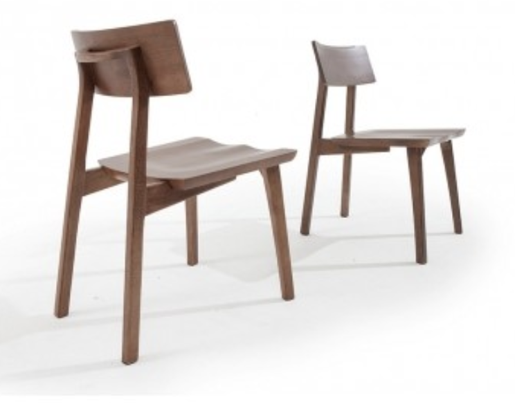

1월에서 6월이라니.. 거 너무 한거 아니요?
--------

이번주부터 시작해서 조직 3분기 All hands 미팅, 그리고 돌아오는 주의 화요일에는 Amazon.com 전사 All hands 미팅이 예정되어 있습니다. 이제 3분기를 마무리하고, 더불어서 전체가 정기적으로 모이는 마지막 회의이다보니, 일도 많은데 참석해야하는 회의도 많아졌습니다. 내년 1월 말이 아마존에서 공식적으로 발표했던 재택근무 (Work From Home) 마감 기준일이어서, 단연 이번에도 COVID와 상관련된 회사의 방침이 정해질 것이라고 모두 예상하고 있었습니다. 이미 구글과 애플은 내년 상반기까지 재택근무를 하겠노라라고 공식적으로 발표한 상황이었기 때문에 어느정도 우리도 조금은 연장하지 않겠느냐 하는 예상은 하고 있었습니다. 그리고 [신문기사](https://www.cnn.com/2020/10/21/tech/amazon-work-from-home-june-2021/index.html)가 나온 날짜인 수요일에 전사적으로 재택근무를 2021년 6월 말까지 연장한다고 발표하였습니다.

저는 한 3월 말정도라고 예상하고 있었는데, 예상보다 너무 많이 연장하게 되어서 조금 당황하였습니다. 7월에 밴쿠버에 랜딩하고, 이제 3개월을 넘어가도록 일을 하고 있어서, 6개월 정도면 그냥 집에서 열심히 일하다 보면 1월 말, 혹은 3월 말부터는 회사에 출근해서 오피스 인테리어를 쓰면서 능률이 늘어날 것이라 예상하고 있었는데, 6월 말이라는 발표를 듣고나니 당장 집의 작업환경부터 아득해졌습니다.

집에서는 이런거 쓰고 있었단 말입니다.. 책상은 원목이었고, 신혼 가구를 마련할 때 깔맞춤을 한다며, 저기서는 앉아봤자 하루에 2~3시간 책 읽는 정도일 것이다라는 예상을 하면서 샀었죠. 그리고 팬대믹이 도래했고, 제 재택근무 오피스가 되었습니다.

이제는 가구를 조금 바꿔야겠습니다.
------
사실 아마존에서는 모든 사원들이 마음에 새기도록 하는 여러가지 리더십 이론이 존재합니다. 그리고 그 중에서도 중요하게 여기는 것중에 하나가 검소함(Frugality)이죠. 일전에 1월까지 재택근무라고 알고 있었을 때 제 매니저에게 `나 집에서 근무하기 힘든데, 모니터 하나 사도 돼?`라고 물어본적이 있었습니다. 매니저는 저에게 저 리더십 이론을 소개해 주면서, 회사에서 당연히 모니터를 빌려줄테니, 그걸 받아다가 집에서 쓰면 된다고 하였습니다. 이걸 들으면서 `아 이 회사에서는 무언가 자유롭게 지급받고 이러는 것은 힘들겠구나`라는 개인적인 생각을 하게 되었습니다.

하지만 이제는 조금상황이 다르지 않을까요? 적어도 8개월 혹은 그 이상을 집에서 더 일해야 하는 저로서는 코로나가 끝나기 이전에 제 허리가 먼저 부러질 것으로 예상하고 있기 때문에 월요일에 매니저에게 당당하게 말해야 겠습니다.

`Hey, I want to buy some furnitures to make more professional WFH environment, here is my list that needs your approval for expense. Feel free to look at and if you have any concerns, please let me know~`

이런거라도 하지 않는다면, 저는 일만하다가 제 허리가 아작나게 생겼습니다. 사실 허먼 밀러 에어론 체어를 사고 싶지만, 그건 너무 비싸니 패스하고 적당한 의자와 적당한 스탠딩 데스크를 요청하고 비용을 지급 받아야 겠다는 생각입니다. 여러분 모두 집에서 일한다면 일하는 도구에 돈을 아끼지 마세요. 하루에 8시간 이상을 그 의자와 그 책상에서 작업해야하니 말입니다. 흐흐 매니저야 기다려랏! ㅎㅎㅎㅎㅎ