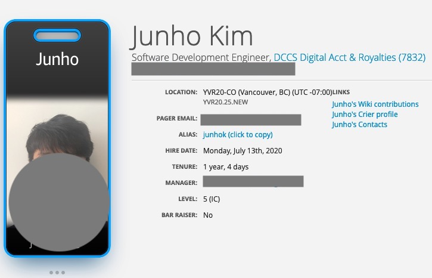

# First Year Retrospection at Amazon

### #0. Preface

I joined Amazon Canada at July, 2020. It was somehow pretty complicated year and somehow simple year in my first year at Amazon. Life in Canada and work at this Company are far way different than I had expected.

This post is my personal opinion. There is no relatiopnship between this article and the company's opinion.

Due to COVID-19, my life also got effect. I was supposed to join the company at April, 2020. However, around February and March, 2020, Canada Government announced new restriction that anyone who wants to come Canada, must have proper visa to come and no one with travel visa cannot enter the country. Anyway, I moved Canada in 2020. July.

This post describes how I felt over the past year.

### #1. English is always an issue.

Except the people who born in the country which uses English as a native language, everyone has a difficulty on utilizing English. This also happens to me either. Since every FAANG companies use English their default communication language, I have no choice but speaking in English. However, if I am influent with this language, my communication cost to let my colleagues understand what I thought is relatively high than people who are fluent with the English.

To get a permanent residence in Canada, I need to get sufficient score for well-known English test such as IELTS, CELPIP. Thanks to the company's policy, I received all expenses for this learning course. Throughout the preparation process, I stepped forward to be familiar with this language, but still need to put my efforts more.

FYI, because FANNG companies are the global company, which means all around people are hired at this company, there are plenty of intonations making you confuse. For example, the word 'back' has various pronunciations ('bak', 'back', bakk', etc. :)) 

### #2. J.D. does not always match with real work life.

When I had an interview with my current co-workers in Korea, they described my job as somehow enormous data management and platform features. It sounds like the combination of data science and backend engineering. That's why I chose this offer with abandoning my comfort home country and moving to this country (yeah, I know it. I want to experience at this global company.).

However, as always says, things did not go as expected. On my second day at Amazon, I temporarily moved from my team to another team of the org located in Seattle. The work was totally different what VP interviewer said in my interview. After 8 confused, boring months, I came back to my original team. However, when I returned, my team had changed main concerns from distributed computing to more domain specific application.

In short, I was supposed to check more and talk more about what I will do seating in my seat, but I did not. As a consequence, I spent almost a year which does not align my career development.

### #3. Peers always let me move forward more.

As we all know, Amazon is the company which has tons of fluent engineers. Even James Gosling who is the father of Java language is distinguished engineer in AWS orgs. The resource pool of Amazon is amazing. My team does not have such "named" developers, but team members are coming from various background and experiences.

For example, one my collegue is coming from Tesla. His background is Electronical Engineering and main duty was battery stuffs. It has nothing to do with our job, but his general ability that he learnd from Tesla made us build more rigorous system. Definitely others normally came from ohter FANNG companies such as Microsoft, Apple. They usually shared knowledge and insights in other companies and we are happy to use them in our skills.

Leveraging this diversity, the team can make a decision more thoroughly and completely.

### #4. Career Growth Plan always focuses on me.

When I had an interview at the hiring process, I normally asked various interviews how Amazon helps people grow. Different from companies that I worked at in Korea, Amazon more focused on me. The companies in Korea also provide various resources such as support to attend developer conferences, encouriging to be a speaker in the community and so on. However, this approach is more generic for all engineers than what FAANG companies take.

In Amazon, there is a policy which helps individual developer to grow regardless their current job position. If one person who works as Backend developer wants to learn and transfer Data Scientist and Machine learning engineer, the leadership is eager to support with company resources. This is beneficial to both of individual engineer and company itself. Individual engineer is able to learn new skills with real examples and company can keep their people in the pool.

Also, normally, team member and the manager meet in an weekly-basis. During this time, we are aiming to solving how I can grow and how my manager helps me to handle my tasks. It is a little bit different that I had experienced in my previous company. I also had several meetings quarterly. However, the meeting's main focus is more like status check and usually happened some unusual event occured like leaves. Weekly or regular meeting with my manager feels me always connected with my higher leadership and caring about me in the management scope.

### #99. Ending

As you may noticed, this is my personal feeling about comparing my previous expereiences and current 1 year in this company. This feeling might change to an unfavorable way or get better.

The cruicial thing is that I am currently satisfied with my current position and want to grow my company together. Nevertheless, there is a homesick that I inevitably forget.
