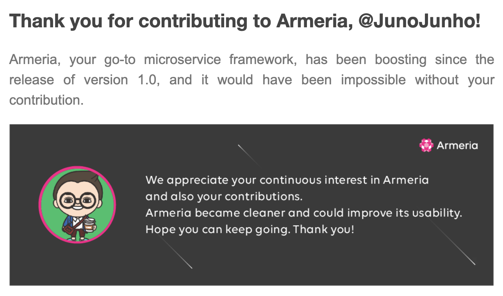

I totally forgot to share this email from Armeria Open Source team.

I had worked for a year and some more months at LINE. When I worked there, [Armeria](https://https://armeria.dev/) is one of the core components used in LINE Server. While working on code base in the server, I really dived deep in this open source project. I also had several chances to contribute my poor quality of code chunks to this project.

They sent me this email to told me thanks.

Taking this post, I also want to mention that Armeria is one of the my best open source project that I ever have touched project before. This project always made me challenge technical solutions. I will keep contributing this project when I am available (normally weekend haha). My current company has strict policy on having another code work other than company's work.