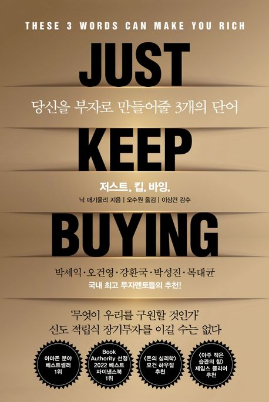

부자가 되게 해준다는 책은 너무나도 많습니다. 그리고 부자가 되기 위해서 가장 중요한 방법 중 하나는 자본주의 사회에서는 모름지기 자본을 사서 내가 일하지 않을 떄에도 자본이 일하게 해서 부자가 되는 것이 가장 근본중에 근본이라고 할 수 있습니다. 그렇다면 이제 문제는 언제 사야하는가? 얼마나 사야하는가? 무엇이 중요한가? 등등 여러가지 질문이 생길수 밖에 없습니다.

상황에 따라서 결정하자
----------------
저자는 20 대에 같은 출발선상에 있었지만, 30 대가 된 지금 이미 밀리어네어가 된 친구들을 바라보게 됩니다. 그 상황에서 무엇이 다른가 하고 생각하죠. `일도 열심히 했고, 돈도 열심히 모았다고 생각했는데, 왜 나는 부자가 되지 못했는가` 라고요. 그 가운데서 중요한 차이점을 발견합니다.

네, 누구나 그렇게 생각하는 것처럼

```
친구는 자본이 일을 하게 했고, 나는 열심히 돈만 모았다.
```

라는 당연한(?) 사실을요.

하지만, 상황에 따라서 간단하게 생각해야할 메커니즘이 있습니다.

1. 지금 내가 모으고 있는 돈이 향후 2년 이내에 사용될 돈인가 ? -> 그렇다면 예금이 가장 안전한 방법이다. 예금은 원금이 보장되어 있고, 약간의 이자를 얻을 수 있기에 가장 확실하게 돈을 지키면서 적은 이자를 바라볼 수 있는 수단입니다. 혹자는 채권은 어떠냐고 말씀하실텐데요. 채권도 가격의 하락과 상승이 있기 때문에, 중기적으로는 나쁘지 않은 선택이라고 저자는 말하지만, 단기(2년 이내)라면 반드시 예금이 확실한 선택이라고 할 수 있습니다.
2. 그렇지 않다면 무조건 주식에 투자해야합니다. 인플레이션을 고려하더라도 무조건 이득이라고 합니다. (어디까지나 저자의 의견입니다.)

정말로 주식이 항상 승리했나?
---------
2022-23년은 전세계적으로 인플레이션이라는 단어가 정말 끊임없이 뉴스에 오르내리는 시즌입니다. 돈을 들고 있으면 휴지조각이 되니, 어디든 투자했지만, 주식은 22년 하반기에서부터 속절없이 떨어지게 되었죠. 많은 사람들이 이게 맞는 건가 하는 생각을 하게 되었죠. 하지만 저자는 역사적으로 그렇게 내려가는 시즌이 있다면, 무조건 사는 것이 이득이라고 말합니다.

여기서 중요한 점은 `길게 봐야한다`라는 점입니다. 최소 10-20% 정도의 하락을 감수할 수 없다면, 주식 투자는 여러분의 정신 건강에 도움이 되지 않을 거라고 말합니다.

언제나 우리는 미래를 예측할 수 없으니 과거를 통해서 미래를 바라보아야합니다. 과거 1890 년대부터 지금까지의 데이터를 살펴보면, 항상 장기 보유하는 주식이 승리하게 된다는 것을 알게됩니다. 인플레이션을 고려하더라고 말이죠.

그렇다면 이제 문제는 무엇을 사야하는지로 가게 됩니다.

개별 주식 vs. ETF
--------
저자의 픽은 단연 **ETF**입니다. 미국 시장 기준, 상위 5%의 주식이 전체 시장 상승을 이끌어 갑니다. 그리고 10년 단위로 시가 총액 상위 기업을 살펴보아도, 오랜기간 살아남는 주식은 없습니다. 물론 여러분이 주식을 정말 잘 볼줄 아는 안목이 있다면, 말리는 사람은 없습니다만, 그렇지 않다면 ETF가 올바른 해법입니다.

혹자는 이렇게 질문 할 수 있습니다.

1. 정말 시장 전체를 투자하는 ETF가 도움이 될까요 ?
2. 나는 채권도 투자하고 싶은데 어떻게 하죠 ?

먼저 첫 번째 질문에는 `네 맞습니다`가 올바른 대답입니다. 시장 상승을 주도할 5% 주식을 고를 자신이 없다면 시장 인덱스를 사면 됩니다. 우리는 뉴스에서 워런 버핏의 신들린 주식피킹을 보지만, 저희는 그런 안목이 없으니 어쩔수 없지요 ^^;

두 번째 질문의 답은 주식과 채권을 섞어주는 ETF도 시장에 많이 나와 있습니다. 일반적으로 주식이 하락장일 때에는 상대적으로 안전자산인 채권에 돈이 몰리게 됩니다. (물론 예외인 상황도 존재합니다만 언젠가는 다시 회복하게 됩니다.) 이 때 ETF의 구성이 주식과 채권의 비율이 일정부분 나누어져있다면 더할나위 없이 피해를 최소화 하면서 어느정도 이득을 취할 수 있게 되겠지요.

언제 사야하나?
-------
간단합니다. `지금`, `당장`. 누구나 지금 사면 더 떨어진 가격에 살 수 있지 않았을까 하고, 팔면 더 높은 가격에 팔 수 있지 않았을까 후회합니다. 일반적으로 여유자금이 될 때마다 지속적으로 사는 전략은 평균 단가를 낮추게 되므로 꾸준히 실행하면 피해를 최소화 할 수 있습니다. 파는 타이밍은 신의 영역이기 때문에 `내가 이 돈이 필요한 타이밍`이 최적의 타이밍이라고 저자는 말합니다.

연금과 세제혜택도 무시할 수 없다.
------------
캐나다 기준, 일정 소득이 넘어가는 개인은 무조건 개인 연금 (RRSP)를 최대한으로 deposit하는 것이 최대 이득입니다. 당장의 돈은 쓸 수 없게되겠지만, 장기적으로 주식 혹은 자본에 투자되어 불어날 것이고, 그 댓가로 매년 세금 환급을 받을 수 있습니다. 제 개인 경험으로도 2만 5천 CAD정도를 한해에 연금에 적립하고, 1만 CAD정도의 세금을 리턴 받았으니, 결코 손해라고 볼 수 없지요. 여기에 이 1만 CAD를 다시 연금 계좌에 투자하게 된다면 거의 정부가 준 돈으로 다시 투자하게 되어 결과론 적으로는 저는 2만 5천 CAD를 가지고 3만 5천, 그 이상의 자본을 손에 넣게 되는 셈이죠.

때로는 소비도 해야한다.
-----------
스쿠르지 영감처럼 언제나 저축만 해서는 자본을 불리는 이유가 없습니다. 이 모든 것의 이유는 우리가 즐겁고 행복하기 위해서입니다. 때로는 소비를 통해서 본인의 리턴을 만족하시길 권합니다. 만약 쓰는 것에 죄책감이 있다면, 같은 금액을 투자해서 그 기분을 상쇄하는 것도 한가지 방법이 될 수 있습니다.

대략적인 리뷰
----------
과거에는 책들이 복잡한 이론을 이것저것 들이대는 것에서 시작했기 때문에, 이해하기도 어렵고 습득하기도 어려웠었는데, 이제는 점점 그 이론이 심플해지는 느낌입니다. 더군다나 저자의 주장은 이해하기 어렵지 않고 모두 데이터에 기반한 주장이기 때문에 한번쯤 고래혀보는 것도 나쁘지 않은 선택이라고 할 수 있습니다.

하지만 언제나 우리는 단기간에 높은 수익을 원합니다. 그렇다면 리스크를 지어야만 합니다. 저자는 비교적 안전하게 수익을 장기적인 관점에서 올릴 수 있는 방법을 소개하고 있으니 그 점을 꼭 기억하면 좋을 것 같습니다.