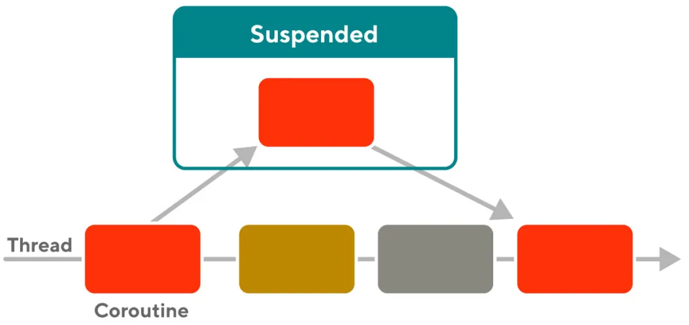

Intro
----
코틀린에는 코루틴이라는 Language-support 비동기 + 동시성 프로그래밍 기능이 있습니다. 코루틴은 스레드와 같은 동시성 처리를 위한 기술이지만, 스레드와는 다르게 메모리를 덜 사용하고, 더 빠르게 동작할 수 있습니다. 이러한 이유로 최근에는 많은 개발자들이 코루틴을 사용하고 있습니다. 어떻게 그렇게 하냐구요 ? 지금부터 한번 살펴보겠습니다. 자세한 내용은 [공식 문서](https://kotlinlang.org/docs/coroutines-overview.html)를 살펴보시면 좋을 것 같습니당 :)

Coroutine Internal
----
코루틴이 어떻게 내부적으로 동작하는지에 대한 내용은 다양한 기술 블로그들에서 다루고 있습니다. 예를 들어 [도어 대시(Door Dash)](https://doordash.engineering/2021/11/09/the-beginners-guide-to-kotlin-coroutine-internals/), 일반 [스택 오버플로우](https://stackoverflow.com/questions/53526556/how-do-kotlin-coroutines-work-internally)질문에서도 이러한 내용을 다루고 있지요.

간단하게 요약해보면, 코루틴은 컴퓨터 프로그램 컴포넌트중 하나로 OS에서 배웠던 프로세스가 우선 점유 되는 현상(Premption)이 없는 non-preemptive 멀티태스킹을 말합니다. 코틀린의 코루틴은 그 기능을 suspend와 resume 기능(간단하게 잠시 멈추었다가 재개하는 방법)을 통해서 구현하였다고 할 수 있습니다. 코루틴은 이러한 기능을 토대로 언어레벨에서의 기능 지원과 JVM 런타임과의 콜라보로 매우 쉽게 비동기 프로그래밍을 고수준의 성능을 뽑아내면서 할 수 있다고 할 수 있죠. 동일한 스레드 내에서 앞서 말씀드린 작업이 이루어지기 때문에, 자바의 멀티스레딩에서 볼 수 있는 컨텍스트 스위치에 대한 오버헤드가 적다고 할 수 있습니다.

예를 들어 간단하게 공식 문서에 나와있는 예제를 살펴보면,

```
import kotlinx.coroutines.*

//sampleStart
fun main() = runBlocking {
    repeat(100_000) { // launch a lot of coroutines
        launch {
            delay(5000L)
            print(".")
        }
    }
}
//sampleEnd
```

위의 예제는 10만개의 코루틴을 생성해서 각 5초간 멈췄다가 `.`을 찍는 것을 실행합니다.



위의 그림처럼 코루틴은 1개의 스레드에서 실행되면서 외부 IO를 기다리는 등 해당 태스크에서 별도로 진행할 일이 없는 경우 Suspended state로 들어가게 됩니다. 이 작업은 코틀린 스케줄러에 의해서 일어나게 되구요. 그리고 해당 스레드는 다른 코루틴의 작업을 진행하게 됩니다. 사실 suspended를 blocked로, coroutine이라는 단어를 thread로 바꾸어보면 자바의 비동기 프로그래밍과 컨셉이 동일하다고 할 수 있습니다.

위의 예제에 더해서 suspend가 가능한 코루틴을 만드려면 아래와 같이 `suspended`키워드를 추가해주면 됩니다.

```
suspend fun doSomethingUsefulOne(): Int {
    delay(1000L) // pretend we are doing something useful here
    return 13
} 
```

위의 예제는 명시적으로 코틀린 스케줄러에게 이 메소드는 suspend가 가능하다고 명시해주어서, 효과적으로 코틀린의 자원 활용이 가능하다고 할 수 있습니다.


그러면 왜 멀티스레딩 대신에 코루틴을 사용해야하나요?
---
코루틴은 스레드와 달리 경량화된 스레드로서, 단일 스레드에서 많은 코루틴을 실행할 수 있습니다. 또한 구조화된 동시실행을 사용하여 범위 내에서 작업을 실행하므로 메모리 누수 감소 효과가 있습니다. 코루틴은 처리 도중 취소가 가능하고, 실행중인 코루틴의 계층구조를 통해 자동으로 취소가 전달됩니다. 이러한 계층 구조를 여러개의 코루틴을 하나로 묶는 Stack이라고 할 수 있는데, 이는 다음에 살펴보도록 하겠습니다. 이러한 특징들로 인해 코루틴은 비동기 프로그래밍에서 많이 사용됩니다.

즉 경량 (1개의 스레드 내에서 여러개의 코루틴을 동시에 사용) + 언어 수준의 지원을 통한 고성능 멀티 태스킹이 가능하기 때문이라고 할 수 있습니다.